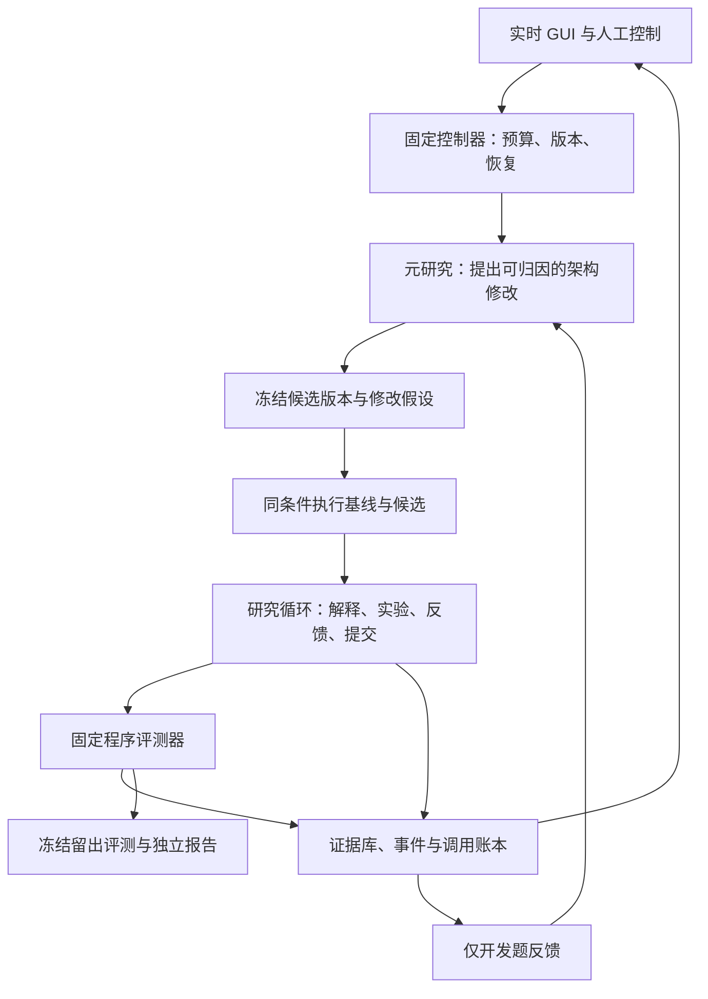

# 元研究框架

## 当前进度（2026-09-06）

真实 A 股案例已接入，详见 [数据审计](META_ASHARE_DATA_AUDIT.md)、[评测协议](META_ASHARE_PROTOCOL_DRAFT.md) 与 [逐轮工程自检](META_ITERATION_JOURNAL.md)。下文保留初版合成 MVP 的实现与验收边界；其中“尚未接入真实案例”描述的是初版，不代表当前新增的 A 股模块。

当前包含历史CSI500主板的五道普通任务、可组合因子表达式、逐组年度诊断、组合回测与冻结提交。每架构可配置6–18次研究调用；可以从已完成运行冻结一个候选指导，在新题独立复用，不再付费重写元提案。支持单架构运行和批次调度，避免一方失败阻止另一方。任意代码自修改、跨家族正式验收、L2策略接入及自动晋升尚未完成。首轮13次真实调用结果见 [完整报告](META_ASHARE_FIRST_REAL_REPORT.md)。

新版GUI：`http://127.0.0.1:8769/`，账本 `experiment_traces/meta_ashare_v2/`。首轮完成账本和市场暴露历史已用SQLite backup复制进新目录；旧服务保留，禁止同一root创建第二个worker。可运行默认隐藏启动脚本 `scripts/start_meta_gui.ps1`，或：

```powershell
.\.venv\Scripts\python.exe scripts\run_meta_framework.py serve --root experiment_traces/meta_ashare_v2 --port 8769
```

GUI 默认选择 A 股真实行情；命令行单轮使用 `run --case ashare --mode live --root <独立目录>`。`fixture` 仅替换模型响应，若选真实 A 股案例，仍会执行真实行情的开发/确认评测并登记查看；不应为了 UI 测试重复打开真实留出，自动化测试使用单独的小型人工行情。

真实案例固定2017–2021开发、2022–2023确认、2024–2025最终期封存。本金100万、目标单股最多10%、不足名额留现金、无杠杆、次日开盘、最低佣金和日期税费、双边各10bp滑点。买单/部分卖单按原始股数整手，但复权单位全平仍可能出现小数股；`execution_valid=false`并给出异常统计。公司行动现金流、容量、竞价与数据历史版本待验证。

风险控制：6轮默认软提醒60万token、单run硬上限120万、每架构50万、调用最多26（正常最多13）、单次30分钟、活动4小时。研究轮数增加时总量上限按比例扩宽；12轮每架构100万token事故上限。运行完成/暂停后释放行情缓存，已付费回执复用。源码与候选指导冻结，请求创建通过request_key去重，未知结果不盲重试。不同题共享同一市场暴露键，换题不重置留出。

## 冻结开发批次

批次默认两道新题×两次启动×两种架构，共8个独立run，每个最多12次研究调用。每题顺序预先定为AB、BA；重复ID不是模型seed。全批8M token、24小时为事故上限，每个在途项预留1M。只用开发期，不打开确认或最终期。所有计划项、失败和未启动项留在报告里。

```powershell
.\.venv\Scripts\python.exe -m quanta_agents.meta.batch plan --api-url http://127.0.0.1:8769 --source-run-id meta-20260906-001003-9b47f3 --output-dir experiment_traces/meta_ashare_v2/batches/dev_20260906_01
.\.venv\Scripts\python.exe scripts\supervise_meta_batch.py --output-dir experiment_traces/meta_ashare_v2/batches/dev_20260906_01
```

`plan`只冻结计划、不调用模型；已有计划不可覆盖。`run`持续监控/推进，`tick`只对账一步，`status`只读本地报告。创建请求丢回执后只能按request_key查询；找不到仍停在attention，不能重复POST。GUI的批次卡显示总体进度、token、预留及当前run，逐轮卡显示模型实际公开说明、程序证据和两问。日常恢复使用现有run控制；取消任一成员会停止整个批次后续启动。

Windows推荐使用上面的监督脚本。首批启动时，调度器更新`report.json`曾遇到WinError 5，研究worker仍正常运行。监督脚本仅对报告文件访问错误作有上限的恢复，重新进入相同计划与request_key进行账本对账；不会修改模型、研究源码、计划或未知付费调用的重试规则。连续8次文件访问失败会停止，取消、预算、冻结漂移和未知模型结果也照常停止。操作脚本及其所用冻结模块的哈希另存`supervisor_manifest.json`，历史故障日志保留。

## 初版合成 MVP（保留验收记录）

本模块用于验证“改进策略研究指导 → 执行相同任务 → 收集真实程序反馈 → 冻结提交 → 比较”的工程闭环。所有真实 LLM 调用固定为 `gpt-6-astra`、`xhigh`。

**当前只有一个明确标记为 `synthetic_fixture` 的合成趋势反转案例。它不提供真实 alpha、架构优越性、跨任务泛化或统计显著性的证据。** `live` 模式表示真实调用模型，数据仍然是合成数据；`fixture` 模式使用确定性响应，不调用模型。

## 当前实现与边界

一次运行按 LangGraph 状态图依次完成：

1. 冻结源码、案例、模型配置与评测协议，计算默认策略的开发期证据。
2. 基线架构进行两次研究调用：初次提出策略，读取开发期结果后提出最终策略。
3. 元研究员读取基线开发轨迹，提出一个新的 `research_instructions`。
4. 候选架构获得相同起始案例，也进行两次研究调用。
5. 程序冻结双方最终策略，分别运行 final 时期评测。
6. 保存比较报告和调用账本；**不自动晋升架构，不启动实盘。**

正常无重试时共五次模型调用。研究次数相同不代表双方实际 token 消耗相同，报告应结合调用账本阅读。候选指导是在本题开发证据上构造的，因此这一流程属于同题开发联调，不是独立架构盲测。

元研究员目前只能提交研究指导文本，不能修改模型、预算、数据、回测器、评分器或任意 Python 代码。模型输出必须符合 JSON Schema。策略执行采用固定程序解释的受限 DSL，没有 `eval`、`exec` 或模型生成代码执行路径。真实模型网关禁用工具，研究模型只接收显式构造的输入。

这不是已经接入 V2 的完整自由研究器，也不是具备任意代码自修改能力的通用元优化平台。

## 启动与使用

在 `QuantaAgents` 目录运行：

```powershell
uv pip install --python .venv\Scripts\python.exe -r requirements-meta.txt
.\.venv\Scripts\python.exe scripts\run_meta_framework.py serve --port 8767
```

也可用 `scripts\start_meta_gui.ps1` 隐藏启动本地服务。服务只监听 `127.0.0.1`，拒绝外站来源和异常 Host；同一运行目录由进程锁保证只有一个服务持有。服务运行时，从界面启动实验，或给命令行实验指定另一个 `--root`，避免重复 worker。

本地界面地址为 `http://127.0.0.1:8767`。也可直接运行一次：

```powershell
# 离线联调：不调用 LLM。
.\.venv\Scripts\python.exe scripts\run_meta_framework.py run --mode fixture

# 真实模型调用：仍使用合成行情，须具备当前主机的模型调用能力。
.\.venv\Scripts\python.exe scripts\run_meta_framework.py run --mode live
```

界面提供启动、暂停、恢复、停止、人工留言与产物查看。暂停一般在安全步骤边界生效，不能等同于已取消供应商端正在执行的请求。人工留言会标记 `comparable=false`，其后结果保留为人工参与的研究记录。

本模块测试：

```powershell
.\.venv\Scripts\python.exe -m pytest tests/test_meta_benchmark.py tests/test_meta_gateway.py tests/test_meta_runtime.py tests/test_meta_server.py -q
```

## 案例、数据与交易语义

`src/quanta_agents/meta/benchmark.py` 公开以下接口：

| 接口 | 用途 |
|---|---|
| `strategy_schema()` | 返回全字段必填、拒绝额外字段的策略 JSON Schema |
| `baseline_strategy()` | 返回共同起点参数的新副本 |
| `case_manifest()` | 返回案例标识、数据性质、时期边界、评分协议和局限 |
| `development_packet()` | 返回任务、开发数据概况、最近 32 行 OHLCV、子期概况和默认参数 |
| `evaluate(strategy, split="development")` | 执行策略，返回实际计算的指标、诊断、交易明细与内容哈希 |

案例使用固定 seed 产生 840 个工作日的单资产 OHLCV。不同时间段有不同漂移、波动及自相关，未植入任何必须找出的均线答案。日期只是合成数据索引，不代表那些日期的真实行情或真实交易日历。

- 前 600 行为 development，后 240 行为 final，按时间顺序隔离。
- 模型包只包含开发时期概况与部分原始行，不包含 final 行情或收益。当前没有通用取数、绘图和自由诊断工具，此限制也约束了研究能力。
- final 从现金开始，可使用分割点以前最多 65 行作为信号预热；不会继承开发期持仓或收益。
- 初始资金 10,000，单资产满额、允许分数份额，不借款、不做空；空闲现金收益为零。
- 收盘确认信号，下一交易日开盘买入。买入数量包含开仓手续费，现金不能透支。
- 以收盘价观察止损与持有期限，下一交易日开盘卖出；跳空按实际开盘价承担，不能假设以止损阈值成交。
- 双边各收 0.1% 手续费。区间最后一天按预先声明的收盘价清仓并收取平仓费；这是固定期末结算规则，不是通过未来行情选择退出。
- 没有市场冲击、买卖价差、涨跌停、停牌、交易单位或容量模拟，因此不能用结果推断可执行实盘表现。

允许的策略字段：

| 字段 | 边界 | 含义 |
|---|---|---|
| `lookback` | 整数 3–60 | 确认阶段以前的下跌观察长度 |
| `decline_threshold` | 0.005–0.25 | 前段收盘跌幅的最低绝对比例 |
| `confirmation_days` | 整数 0–4 | 下跌之后连续收盘上涨的天数；0 表示关闭确认 |
| `hold_days` | 整数 1–30 | 观察到指定持有收盘数后，发出次日开盘退出指令 |
| `stop_loss` | 0.01–0.25 | 相对入场开盘价的收盘止损比例 |
| `volume_filter` | 0–3 | 0 表示关闭；否则为当日量相对之前 `lookback` 日均量的最低比率 |

非法字段、缺失字段、布尔值冒充数字、非有限浮点数及越界参数会被拒绝。DSL 边界用于最小工程验证；它限制了可发现策略的范围，不能用于判断模型的总体创造力。

## 指标、证据与盲测

固定主分数 `score` 为每日完整资金收益序列的年化 Sharpe，采用 252 个交易日、样本标准差与零无风险收益。现金日也计入，零波动时返回 0。还报告总收益、复利年化收益、最大回撤、波动、费用、换手、持仓比例、交易次数、胜率与含费买入持有收益。

三个子期是**同一持仓路径的连续切片**，不是独立折或三份独立证据。交易明细记录信号日、实际成交日和价格、手续费、净收益与退出原因。`eligible` 仅表示完成至少五笔交易，不代表通过统计显著性、真实 alpha 或架构晋升门槛。

每次评测保存标准化策略哈希、当前评测数据哈希、预热数据哈希和评分协议哈希。源码快照同时留存，便于查明具体执行语义。final 只能由冻结提交步骤调用，结果不反馈给研究模型或元研究模型。

**这里的 final 是接口上的留出，不能称为秘密测试集。** 合成生成器与 seed 是公开源码，可以重建 final 数据。严格的真实研究评测还需要执行权限和数据服务隔离，而不能只靠提示词声明。反复看 final 后再调整架构也会污染它；这样的运行只能转为开发记录。

`comparable=true` 最多说明本轮没有人工留言等已知干预，不代表研究次数、任务家族数或数据独立性足够证明架构胜出。当前报告固定禁止自动晋升；允许没有改进、交易不足或证据不足。

## 持久化、恢复与 token 风控

默认输出目录是 `experiment_traces/meta`。LangGraph 使用 SQLite checkpoint；独立 SQLite 账本记录运行、事件与模型调用。每轮目录保存源码快照、冻结协议、开发证据、候选指导、最终提交、final 结果与比较报告。

调用前登记请求及在途预留，结束后对账实际 usage；正常完成、失败、重试和元设计消耗都属于本轮成本。重启时，未确认结束的调用标为 uncertain，不能盲目自动重复支付。已完成并落盘的同一请求可复用。原始供应商用量与计量状态应保留，未知不能解释为零。

软阈值用于提示和检查异常，不把正常长推理、否定实验或短期没有盈利视为失控。硬阈值、调用次数、重试和超时约束用于防意外扩散；发生中断时先保留证据和断点。并发在途预留与实际回执仍可能有误差，不能把本地阈值宣称为供应商账单的绝对硬上限。

正式 A/B 的冻结实验预算与日常事故熔断是两种不同控制。前者服务于公平比较，后者防止循环重试、重复委派或未知调用失控。

默认软提醒 250,000 token、整轮事故上限 500,000 token、每架构 200,000 token、总调用 12 次、同一步最多两次尝试、单次 30 分钟、整轮活动时间两小时。未知调用按每次 32,000 token 预留；这是事故缓冲，不是已知实际用量。元设计成本单独按角色统计，并同时计入整轮总消耗。缓存输入已包含在输入中，推理输出已包含在输出中，均不重复加总。

普通恢复不自动重试失败或结果未知的调用；需要时使用“明确重试”，旧尝试仍保留。供应商调用完成与产物有效性分别检查，非法 DSL 会记录失败及已有用量。原始事件、请求、最终响应、stderr 和调用回执可作为 ZIP 下载。界面每秒拉取增量事件，token 只在提供方返回 usage 时刷新，等待期明确标为未知。`reasoning` 事件是提供方实际公开的摘要，不是原始隐藏思维链。

当前 Codex CLI 不允许覆盖 `model_providers.openai` 这个内置 provider；不能用这些配置项声称已关闭 CLI 内部网络重试。外层 harness 不自动重试付费调用，CLI 内部行为仍受其版本影响，并由本地超时与取消限制。真实调用使用显式模型/effort、忽略用户配置与 rules、禁用工具相关 feature 和只读沙箱；任何实际工具事件都会停止调用。启动诊断中的 `item.type=error` 不等于执行了工具，真实 turn 终止状态决定调用是否成功。若事件没有独立报告模型身份与 effort，回执明确记录“请求已锁定，提供方未完整确认”，不把模型自己声称的身份当验证。

## 完整元框架的设计分层



元研究可以改变候选研究方法；控制器、最终评测及预算账本属于独立信任域。MVP用受限数据输出避免任意代码执行，未来开放代码修改必须通过隔离 worker 和权限服务落实边界。GUI负责观察、控制与干预记录，不持有唯一运行状态。关闭网页不会停止实验，停止模型调用须使用运行控制。

每份候选修改应记录父版本、修改内容、预期解决的失败类型、因果假设、预期改善和退化风险。先在开发任务上排除无效版本，再冻结进入架构留出题；不得把每题事后挑最好版本的分数当作单一可部署架构的分数。组件数量、强制评审与上下文重置都作为待检验变量，保留同 Astra/xhigh、工具充分的简洁基线。

正式案例清单应同时标识策略家族、开放定义或相同基线任务、提示词变体、数据与执行约束、允许工具、研究预算、提交格式以及开发/确认/最终时期。最终版本必须在查看隐藏评测前选定。所有重复运行和失败均保留；同题复跑用于观察随机性，跨家族题用于检查迁移。人工干预、共享记忆或外部资料造成的信息流变化必须记录，不能混入原定公平比赛。

目前这些正式比赛能力尚属设计协议。当前代码只实现一个合成案例、两种指导方式的一轮开发联调，不具备跨家族竞赛、任意代码元修改或持续自动晋升能力。

## 经验来源与采用方式

| 一手资料 | 对应设计 |
|---|---|
| [OpenAI Harness engineering](https://openai.com/index/harness-engineering/) | 工具可见的证据、简短索引、可检验的约束 |
| [OpenAI Codex loop](https://openai.com/index/unrolling-the-codex-agent-loop/) | 稳定前缀与工具配置；保存真实事件和用量 |
| [Anthropic 长任务 harness](https://www.anthropic.com/engineering/effective-harnesses-for-long-running-agents) | 有限工作增量、外置研究状态、恢复已有成果 |
| [Anthropic 模型与 harness 设计](https://www.anthropic.com/engineering/harness-design-long-running-apps) | 对流程组件消融，避免强模型过度约束；评审需校准 |
| [LangGraph Checkpointers](https://docs.langchain.com/oss/python/langgraph/checkpointers) | 同步落盘；区分恢复与会重新付费的主动重放 |
| [Temporal 重试策略](https://docs.temporal.io/encyclopedia/retry-policies) | 故障重试预算单独管理；防止默认重试扩大消耗 |
| [GEPA FAQ](https://gepa-ai.github.io/gepa/guides/faq/) | 防题目关键词过拟合、评分格式漂移与事后挑选成绩 |
| [RD-Agent](https://github.com/microsoft/RD-Agent) | 假设、实现、程序验证和证据分析分开 |
| [autoresearch 实验协议](https://github.com/karpathy/autoresearch/blob/master/program.md) | 小修改范围、固定评分、全部尝试留档；不照搬无限循环 |

这些来源提供工程假设和失败经验，不构成 Astra/xhigh 在本项目中的效果证明。

## 后续接入 V2 与正式架构竞赛

下一阶段可用相同接口接入现有 V2 的一句话策略定义与数据 manifest，但必须另外实现：

1. 数据与工具适配：实际可用时点、成交假设、费用、资产池和风险边界保持一致。
2. 两类任务：开放定义赛衡量端到端研究；相同基线代码赛更集中衡量诊断和迭代。
3. 开发断点与短续跑筛选；冻结候选后，在未参与调优的机制家族上运行完整任务。
4. 每个任务内部再隔离未用于构想的市场时期；家族与时期分别衡量，重复采样不能替代跨家族证据。
5. 保留所有收益窥视、候选、失败与预算记录；每轮只提交一个最终策略。禁止根据隐藏结果反复调试并继续称为盲测。
6. 评测器、数据与预算权限由固定执行器控制。允许的架构改动逐步扩大，不把任意终端或整仓库写权限交给元优化器。

这些属于后续工作，当前 MVP 尚未实现。正式晋升需要新的冻结验收批次，不能用本合成案例的胜负代替。
