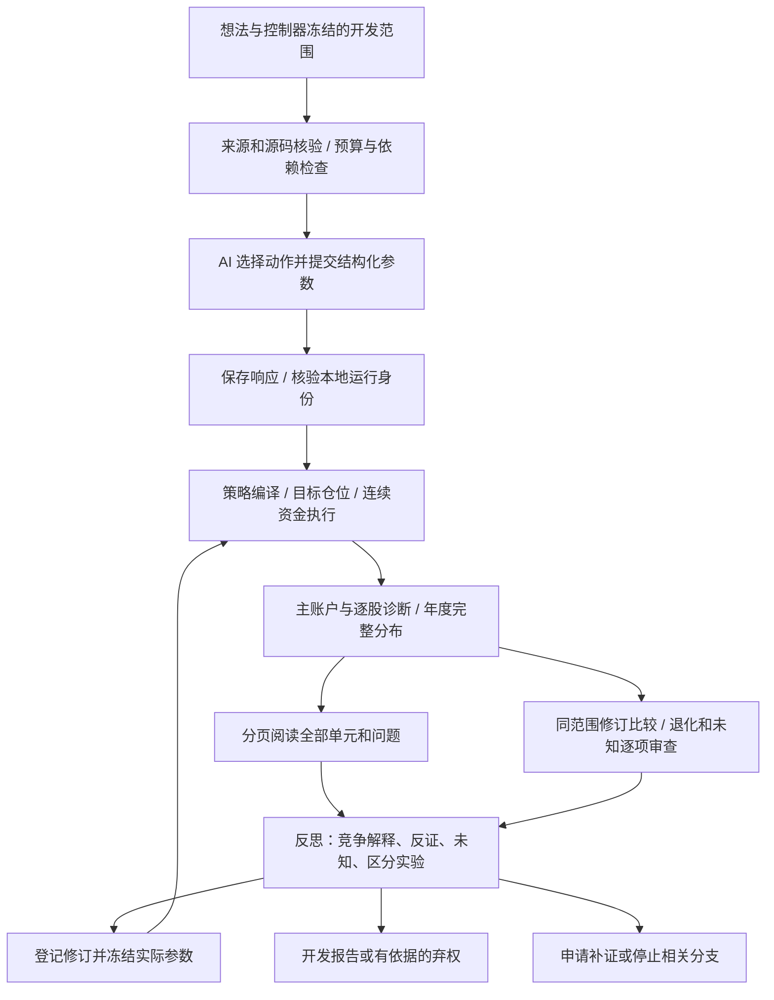

# QuantaAgents 元框架主记录

更新日期：2026-09-08。项目根目录：`D:\大学\金融投资与量化\ai策略迭代开发\QuantaAgents`。

本文件记录当前元框架的设计、实际实现、保存的验证证据和未完成事项。它是交接快照，不是实时监控页面，也不授权启动研究或修改冻结范围。

## 1. 当前状态与工作归属

当前研究版本为 **V5 开发版 `quanta_research_v5_001`**，在 V4 的调度、来源准入、模型调用、账本、资金账户和恢复机制上增加跨年度、跨标的诊断及反思修订约束。已具备可执行的新研究入口，尚未证明能够稳定发现正式样本外、真实执行成本后净 Sharpe 严格大于 1 的策略。

用户最新决定：**本对话只完成本文件并关闭；停止监控、并行研发及跨对话消息，不再接受或建立跨对话共享协调机制。实际研究由已有的另一个对话独立继续。** 本文件不要求该对话回复，也不附带监控、回访、通知或自动启动安排。

已有实跑由任务 `01a0812b-1f03-72a1-ae4f-fffbb16ebe04` 持有，输出目录为 `output/research/meta_v5_efficiency_2018_2019_20260908/run_001`。记录该 ID 仅用于定位，不是消息发送指令。

| 层次 | 已确认的状态 | 不能据此推出的结论 |
|---|---|---|
| V4 执行与研究底座 | 调度、预算、保存回执、受控执行、时点收益视图等已有实现和检查记录 | 全部真实来源、历史可得性、成交容量已认证 |
| V5 研究决策层 | 年度/标的诊断、完整阅读、反思、修订绑定和退化审查已接入实际循环 | 模型解释正确、创造性提高、V5 优于其他架构 |
| V5 新真实开发研究 | 两股、两年、连续资金范围已冻结，并已有实际 AI 调用及基准执行 | 完整闭环已完成、候选已盈利或通过正式验收 |
| 正式金融与架构验证 | 原要求保留；本记录没有新增合格正式成功 | 开发回测、工程测试或旧资料复评等同正式 OOS |
| GUI | 已有 V4 静态监管快照；此前实时服务不可用 | 页面已实时展示 V5 进度或已完成视觉验收 |

运行信息采用本对话停止跟踪前的证据：2026-09-08 21:55 香港时间，账本中第 1 次调用为 `applied`、已知 21,183 token；第 2 次为 `applying`、已知 23,433 token，合计 44,616。第二次模型回答已经收到，工具正在执行基准账户。该数字不是当前实时用量，也不是完整研究成本。之后实跑对话单次反馈基准推进至 2018-12-20；本对话未独立复核该进度，也不继续轮询。

## 2. 版本关系：名称与代码位置

| 名称 | 主要位置 | 作用 |
|---|---|---|
| 早期 V2 研究循环 | `workflow_v2.py`、`daily_research.py` 等 | 历史实现与研究记录，不能当作当前 V5 入口 |
| V3 命名空间 | `src/quanta_agents/meta_v3/` | 当前 V4 底座仍在此目录，包字段保留 `3.0.0-dev` |
| V4 控制器 | `meta_v3/controller_plan.py` | `HARNESS_VERSION = 4.0.0-dev`；依赖调度、证据和执行约束 |
| 冻结 v18 内核 | `experiment_traces/meta_ashare_revision18/src/quanta_agents/` | 通过 `meta_v3/kernel.py` 加载的原账户/执行能力 |
| V5 研究层 | `src/quanta_agents/meta_v5/` | `quanta_research_v5_001`；跨年度、跨标的证据进入研究决策 |
| V5 命令入口 | `scripts/run_research_v5.py` | 新建、检查及运行新 V5 开发计划 |

目录名、控制器版本和研究层版本并存有明确原因。不能为了统一名称复制整套内核，或改变旧运行的源码身份。当前新实跑的启动清单冻结了 148 份源码，后续代码修改不能被补写成此次运行原本使用的版本。

## 3. 核心设计思路

目标流程是：普通想法或文档进入研究，模型提出可能的解释与可否定预测，通过受控工具取得执行证据，再决定继续检验、结构修订、补充资料或有依据地弃权。

关键设计原则如下：

1. **模型提出研究动作，工具计算与保存证据。** 模型不能直接提交任意净值、伪造已成交记录、改变本金或自授正式数据访问权。
2. **局部缺口只阻断依赖它的动作。** 工作项记录问题、必要证据、依赖与停止条件；某项税务或来源缺失不应让所有独立工程工作停止。
3. **总收益之外必须看完整分布。** 每个原股票、原年份、现金日、亏损、失败与未知都保留；高总分不能代替解释坏年份和跨股票差异。
4. **反思必须影响下一次实际实验。** 反思引用原证据，登记具体区分实验，再绑定下一次完整程序或批次参数，防止只写一段解释后继续自由扫描。
5. **资金和时间连续。** 年度指标由同一资金路径切片，不能每年重置本金、删除暖窗现金日或只展示成功退出。
6. **证据等级独立。** 文件哈希、工程通过、开发筛选通过、因果机制成立、可执行收益和正式统计通过分别记录。
7. **预算与失败永久留账。** 已知 token、未知预留、候选、工具及执行尝试保留；保存回答优先恢复，不为重复付费或重跑创造新机会。

V5 不以要求更多角色或更长提示词作为主要改进。实际改变的是模型可观察的证据、工具前置条件和研究状态转移。结构合规仍不能证明自然语言解释具有科学价值。

## 4. 实际研究链路

上述链路不自动开放正式留出资料。`strategy_for_development` 是开发结果类型，不是正式投资策略发布。

## 5. V4 底座的具体实现

| 模块 | 关键实现职责 |
|---|---|
| `runtime.py` / `ResearchRuntime` | 核验计划与来源、调度调用、应用工具、保存状态、恢复已返回结果 |
| `controller_plan.py` | 验证工作依赖；根据证据、来源和身份条件形成可运行工作列表 |
| `ledger.py` / `Ledger` | SQLite 保存 `stage`、`tasks`、`calls`、`events`；绑定计划、调用意图、回执和结果 |
| `closing.py` | 调用数、token、截止时间和最终报告机会的预算规则 |
| `codex_session_gateway.py` / `identity_route.py` | 使用现有 Codex 调用路线；捕获与逐次核验本地会话身份 |
| `research_tools.py` / `research_iteration.py` | 策略开发、执行诊断、实验登记、资料扩展请求和报告检查 |
| `research_extension.py` / `source_admission.py` | 对资料与能力扩展做有界准入，校验来源及父子范围关系 |
| `real_program.py` / `target_schedule.py` | 校验程序、在冻结字段上计算目标，并应用明确的调仓时序 |
| `saved_execution.py` / `structural_execution.py` | 连接既有保存行情和股份账户执行路径 |
| `context.py` / `evidence_views.py` | 有界上下文、工作证据索引、分页与实际证据送达记录 |
| `claim_support.py` / `experiment_design.py` | 对声明引用及实验设计实施限定范围的机器检查 |
| `tool_resources.py` / `process_envelope.py` | 工具与子进程资源登记、用量及未知记录；具体约束取决于入口 |
| `evaluation_custody.py` | 已暴露旧账户的一次性核验托管；不是通用正式评估器 |

调用状态需要区分：`pending` 是响应尚未结算；`received` 表示保存响应；`applying` 表示应用工具中或应用结算尚未完成；`applied` / `failed` 是该动作的结算状态。`applying` 不能单独解释成失败，也不能仅凭它判断进程仍活着。

恢复路径优先核验 `application.json` 或已保存工具返回记录。若已应用动作缺少完整收据，保持未解决状态，不能直接重跑策略或再次调用模型。旧记录的失败和未知不会因新版本出现而清零。

## 6. V5 具体模块与数据结构

### 6.1 `analytics.py`：完整年度与标的诊断

核心接口为 `evaluate_bundle(bundle, policy)` 和 `compare_profiles(old, new)`。

`v5_stability_bundle_v1` 绑定 `candidate_id`、`program_hash`、`scope_id`、`split=development`、固定有序 `expected_units` 和候选/基准 `pairs`。每个 pair 含单元类型、完整日历、初始净值，以及等长的 `nav`、`exposure`、`fees`、`stale` 序列。未知值用 `None` 表达，不插补为零。

年度起点取上一交易日净值；第一段取原始本金。对完整路径计算：

- 每日收益 `NAV_t / NAV_(t-1) - 1`，现金日仍在日历中。
- 年度收益、全期收益、样本标准差 Sharpe、最大回撤、平均暴露、费用和陈旧估值比例。
- Sharpe 的日无风险率为 `(1 + annual_rf) ** (1 / annualization) - 1`；零波动或缺少有效路径不强行给出有限高分。
- 年度超额为候选与同口径基准的年度收益率差。
- 正年度现金 PnL 集中度用于描述收益集中，不代表独立 alpha 归因。

输出 `v5_stability_profile_v1` 包含 `cells`（单元×年份）、`full_period`、`summary`、`issues`、`comparison_identity` 与哈希。开发门分别检查覆盖、来源质量、年度增量、跨单元增量、最差年度损害、风险、集中度及可选执行认证。缺股票或缺年份仍保留预期分母。

修订比较固定股票、年份、日历、资金、基准、成本和共同来源身份。允许程序改变，不能顺便换比较口径。`formal_target_success`、`causal_mechanism_identified` 和 `statistical_significance_established` 不会因诊断通过自动变为真。

### 6.2 `reflection.py`：证据绑定的反思

`validate_reflection(declaration, profile)` 核验候选、程序、范围和 profile 身份，以及实际引用的单元、字段和报告数值。反思保留全部原单元及问题，逐项给出未知、数据缺口、暂定解释或停止决定，并保留反证状态。

实验分为 `source_completion` 与 `discriminating_test`。区分实验需要原候选及同范围基准作为控制，明确预测支持和反驳哪些解释。可交易条件必须对应上一完整交易日可得的信息；年份编号或事后好坏年份不能直接成为交易条件。

`next_actions()` 依据保存的问题和反思形成下一动作。校验通过只证明结构、引用和绑定合规；声明本身仍标记机制未识别、实验尚未执行。

### 6.3 `tools.py`：将诊断与反思接回运行

`V5ResearchTools` 继承 V4 `ResearchTools`，增加六个动作：

| 动作 | 实际作用与前置条件 |
|---|---|
| `profile_execution` | 从本任务已保存的执行与冻结基准生成诊断；配置逐股功能后可能执行有界诊断账户，因此不是通用只读命令 |
| `inspect_stability` | 分页读取摘要、单元、问题和反思；根据实际送达 ID 记录阅读覆盖 |
| `record_stability_reflection` | 必须先读取完整原单元、问题及摘要，才能绑定反思 |
| `register_stability_revision` | 绑定最新反思中的具体可执行实验与下一次完整开发/批次参数 |
| `compare_stability_revision` | 保存同范围、同口径修订前后的完整差异 |
| `record_revision_review` | 对每个变差或未知单元记录解释与是否接受取舍，不能漏项 |

首个候选或首批可在冻结范围内探索；继续搜索前，所有已执行候选均有诊断和反思义务，不能只解释赢家。基线采用控制器预先指定值或最早执行的非基准候选，不能按结果挑选基线。

后续执行通过 `v5_revision_evidence_id` 核验完整提案哈希。已停止或被缺证阻断的实验不能继续。提交开发策略还需完整阅读、引用绑定反思、通过开发筛选，并对实际修订引用完整退化审查；最终仍调用原 V4 报告校验。

### 6.4 `registry.py` 与 `runtime.py`

Catalog 只接受控制器登记的开发资料，保存 bundle、profile、policy、manifest、preparation measurement 和 exposure。核验原文件哈希、政策、profile、共同范围与暴露记录。改名不能恢复留出身份，输入中的 `execution_certified=true` 不能替代实际认证。

`V5Runtime` 继承 `ResearchRuntime`，分别核验 V4/V5 源码、任务合同及 catalog，向模型提供当前研究义务。调度优先处理尚未形成诊断的执行，再结合活动候选的下一动作和冻结优先级选择任务。来源、执行、预算和恢复继续由底座承担。

新建计划固定 `formal_release_authority=false` 与 `fair_comparison_admitted=false`，因此不能通过普通 V5 入口自行登记正式架构比较或释放隐藏资料。

### 6.5 `execution_adapter.py` 与 `unit_execution.py`

`saved_path()` 从已保存账户提取连续净值、累计费用之差、持仓暴露与估值质量。检查原始本金和外部现金流、原日历连续前缀；缺失账户不视为零收益，未知费用或估值不视为已知。

可选 `v5_independent_stock_accounts_v1` 在完整原股票集合上计算同一程序，然后仅保留目标股票的原权重，将其他目标置零。每只股票使用独立的完整本金诊断账户，不放大权重、不跨年重置资金。诊断账户不能相加替代主组合账户。

主账户另保留 `main_portfolio_profile`；其年度结果随诊断摘要送达，不作为额外股票样本计入跨股分母。相同程序、来源和政策的基准逐股账经原件核验后复用，失败、未知及限额未启动账户保留。输出量为轮询停止阈值，不是操作系统硬磁盘配额；CPU 小计不含全部解释器启动与导入成本。

## 7. V4 最新时点收益与风险实现

`asof_return_views.py` 构建每个原始信号时点的版本视图：按 15:10 截止选取当时已到达的价格、公司行动与覆盖版本。后续时点可使用已到达的历史修订，但未来版本不得改写早期视图及其身份。

风险窗口为 60 个收益及所需的第 61 个收盘，保留原五日锚点。迟到、缺失、同刻冲突、撤销、未知到达或凭证内容不符均不能获得合格生成输入。历史短窗口保留为不足，不能删掉或填充。

收益分母采用实际前收盘，现金分红按原股份权益计算；不得把已除息参考价当作原收盘后再加现金分红。价格修订会影响当日分子及次日分母。

`conditional_risk_derivation.py` 提供显式 `generated_conditional_risk_derivation_v2` 路径。原收益字段只能是无值占位，不能有另一套收益兜底。非锚点绑定最近原锚点，避免未来整包资料身份变化污染过去记录；原 v1 输出保持兼容。

`generated_qualified_return` 与真实 `qualified_return` 分离。当前真实合格收益仍为空，生成内容绑定没有替代外部来源认证。该能力已有 V4 工程接入，不应未经运行合同核实就声称当前 V5 研究自动采用了它。

## 8. AI 调用身份问题的当前解释

此前所说的接口是 **AI 调用与其运行记录**，不是股票行情接口，也不是用户授权不足。当前已经存在成功的实际研究调用，无需让用户发送密钥。

现有 `codex_session_v1` 路线保存原始 `runtime_session.jsonl`，核对唯一会话及完整 turn、模型与 effort、输入 prompt、最终结构化输出和调用产物哈希，并拒绝已记录中断或改路由的会话。V4 应用工具要求旧 `model_verified` 或新 `runtime_identity.verified` 满足对应验证条件。

必须区分三层：请求配置为 `gpt-6-astra / xhigh`；本地运行记录与该次输入输出绑定；供应商服务端实际请求及计算身份独立认证。前两层已有实现，第三层 `provider_request_binding_verified` 仍为 false。不能用请求字符串或本地 session ID 伪造供应商 request ID，也不能据此推断实际发生模型降级。

## 9. 新 V5 实跑的冻结合同

以下来自运行前保存材料，不依赖后续结果。

| 项目 | 冻结值 |
|---|---|
| 问题 | 价格路径效率能否区分趋势与反复震荡，并在成本后产生跨年、跨股增量 |
| 股票 | `sh600004`、`sh600006`，保留原顺序 |
| 日期 | 2018-01-02 至 2019-12-31，共 487 日：243 + 244 |
| 资金 | 主账户初始 1,000,000 元，连续运行，跨年不重置 |
| 公司行动 | 已核来源映射的四次现金分红；不代表所有历史更正及到达已完整认证 |
| 基准 | 两股各 0.5 目标权重、每日再平衡，采用共同执行机制及终端规则 |
| 研究范围 | 已暴露的真实市场开发资料，`development`，不是新独立 OOS |
| 模型预算 | 最多 24 calls、1,400,000 名义 token、7,200 秒；单调用及收尾预留 80,000 token，收尾 600 秒 |
| 搜索范围 | 计划基准 + 初始候选 + 反思后修订；最多 4 次 `develop_strategy` 尝试 |
| 逐股诊断 | 最多 8 个账户；单 profile 900 秒，总计 2,400 秒；保留量 256 MiB |
| 金额成本 | 研究及外层准备的实际货币费用未知，不记零 |

声明的模拟成本为佣金每笔最低 5 元或 0.0003、双边过户费 0.00002、该期间卖出印花税 0.001、双边不利滑点 0.001，以及前日成交量 5% 的模拟容量约束。沿用整手、T+1、次日开盘等冻结机械规则。这些是本次模拟合同，不是独立认证的成交与流动性证据。

本次开发政策要求完整股票/年度配对，每年不少于 243 日；全部年度均值与全部股票全期有正基准增量；年度超额损害容忍 0.02、最大回撤 0.25、正年度现金 PnL 集中度 0.75、陈旧估值比例 0。费用与暴露要求已知，`require_execution_certified=false` 是显式开发条件，不能推广为正式条件放宽。

关键记录在 `preparation/`：`selection.json`、`research_preregistration.json`、`case_build_receipt.json`、`unit_execution_contract.json`、`controller_spec.json`、`prelaunch_manifest.json`、`frozen_sources/`。构建 case 的语义哈希为 `87e7f6fb40832840abc8f824405b756306f86e6691a9ac4c893f917c49168632`，字节哈希为 `13fb80a95a038fdd3e6cb0565d7f39617036a490d8b2766b4943a72b7428a6b8`；启动清单中的运行 case 哈希为 `890b74632309839597106eeb4911999445b80687ad19b1f2545cd7db681e9f48`。三个值属于不同身份记录，不能混用；本次快速记录不宣称已完成它们之间全部字段变化的独立审查。

## 10. 已保存的验证与研究结果

| 范围 | 保存的结果 | 证据边界 |
|---|---|---|
| V5 首版集成 | 391 项通过：177 项 V5 + 214 项继承回归；271.61 秒 | 该次版本的工程检查，不是 391 次策略实验 |
| V5 逐股适配后 | 全部 V5 测试 187 项通过，含新增 10 项逐股检查；199.566 秒 | 与前述 177 项重叠，不将 391 和 187 相加计为独立覆盖 |
| V4 逐时点视图与入口 | 当前 101 项定向检查通过；另保存既有 85 项回归通过记录 | 生成资料/临时来源；不构成真实认证 |
| V4 生成整账户 | 16 日、原 100 万本金、48 订单、40 成交、费用 2,308.18 元，期末现金 930,078.82 元 | 保存亏损；真实合格收益仍为 0 |
| V4 保存资料时点诊断 | 49 原锚点：12 窗口不足、37 形状完整；2,562 诊断行 | 固定报告的局部暖窗不足，不证明原完整归档缺暖窗 |
| c007 已暴露复评 | 36 保存账户、108 年度单元、1,260 项指标复核；三个范围均未通过开发筛选 | 回顾诊断，复权单位与陈旧估值限制仍在 |

c007 的固定 16 单股中只有 6/16 全期超过对照；16 股年度超额均值仅 2023 年为正。16 股等权组合六年收益约 35.93%，对照约 76.37%；中证500历史成员等权组合约 3.36%，对照约 29.20%。这些是保存报告中的代理账户结果，不能认证真实执行，不能仅凭它们断言机制永久无效或过拟合原因已经识别。

旧 `v4s1` 已关闭：原 9 槽位、7 终态、2 未启动，37 次模型调用、995,120 已知 token。弃权、终稿失败、部分未知结果、资源超限与未启动机会全部保留，不重开、不补位。旧单次账户核验和保存行情血缘核验也已消费，不因写本文档而重新执行。

## 11. 已知限制与尚未完成事项

1. **真实来源认证仍有限。** 文件存在、哈希相同、参考价对账通过不证明历史到达时点、完整公司行动、更正/撤销覆盖及可执行流动性。
2. **长区间执行受原底座上限约束。** V5 已能诊断保存的六年连续路径，但新执行仍受既有约 16 股票、512 交易日等准入限制。不能把分年重置账户拼成六年结果来绕过。
3. **主账户超时保护存在具体缺口。** 实跑对话反馈普通 `develop_strategy` 的同步原始账户路径只在工具执行前后检查 deadline，没有执行中的墙钟中断，可能侵占 600 秒收尾预留。其只读定位指出冻结公司行动适配器的 `validate_eod_integrity` 对历史 `tax_assessed` 反复调用 `_trade_events`，造成完整 journal 扫描及历史前缀哈希增长。这是运行负责方报告，本文件不将其写成已修复或本对话独立性能验收。逐股适配另有受时限约束的子进程，不能据此认为主账户已获同样保护。
4. **状态展示可能落后。** 此次保存 `status.json` 曾仍为 pending/blocked，而账本已为 applying。静态状态不是进程存活证明；GUI 尚无在本轮完成验收的 V5 实时展示。
5. **反思合规不等于解释正确。** 文本预测有无区分力、实验是否消除混杂、机制是否可泛化，仍要看实际证据。
6. **成本尚未统一准入。** 开发、准备、复核、上下文和子进程成本并未全部纳入同资源架构比较；未知费用保留。时点视图工作量也尚未完整接入公平资源准入。
7. **源码身份有范围限制。** V4 后续专项执行补充了当前包内源码绑定，但不能追溯认证旧运行未记录的文件；清单不等于解释器、第三方库及全部环境认证。
8. **独立案例和正式评估尚不完整。** 原登记仍为 5 个真实题与 1 个负控；新增两股开发研究不自动成为合格第六个独立隐藏案例。

这些事项供后续负责研究的工作参考。本文件不派发修复，不要求同步回复，不在冻结运行中修改源码或追加预算。

## 12. 正式目标保持原口径

正式验证至少要求真实样本外 252 交易日、30 个有效退出批次、最大回撤不超过 25%；以完整原资金的连续逐日净收益、252 年化、样本标准差和年无风险率 2% 计算净 Sharpe，**严格大于 1**，另报无风险率 0 的敏感性。真实费用、股份权益、锁定资金、T+1、整手、停牌涨跌停、税、拒单/部分成交、历史到达和容量门均需通过。

元架构比较要求至少 6 个真实留出案例、3 个机制族、每题每架构 3 次原始启动；三架构最低为 54 次启动，但不等于 54 个独立市场样本。保留原失败分母，成功率至少 2/3、有效策略 Sharpe 中位数大于 1、预注册单侧成功率下限大于 1/2，并处理案例/机制族、重复和共同日期依赖。架构配对增益与策略绝对达标分别评价。

2017—2021 是开发范围，2022—2023 已暴露，2024—2025 只能称本地流程封存，不能推断项目历史或模型预训练从未接触。最后还需冻结后的新增前瞻资料及事先确定的通过/失败/观察条件。重复看旧资料不能创造新的样本外证据。

## 13. 证据入口与后续维护

以下为直接定位入口；历史报告中的“尚未启动”应按其保存时间理解。V5 首版验收文档的“本轮未调用模型”描述的是发布验收阶段，不覆盖之后的新实跑。

- [V5 实现与使用说明](D:/大学/金融投资与量化/ai策略迭代开发/QuantaAgents/docs/research/meta_framework_v5/README.md)
- [V5 设计](D:/大学/金融投资与量化/ai策略迭代开发/QuantaAgents/docs/research/meta_framework_v5/DESIGN.md)
- [V5 验收及原件位置](D:/大学/金融投资与量化/ai策略迭代开发/QuantaAgents/docs/research/meta_framework_v5/VALIDATION.md)
- [逐股适配测试回执](D:/大学/金融投资与量化/ai策略迭代开发/QuantaAgents/validation/meta_v5_unit_execution_20260908/test_receipt.json)
- [c007 复评及经济口径](D:/大学/金融投资与量化/ai策略迭代开发/QuantaAgents/docs/research/meta_framework_v5/C007_REASSESSMENT.md)
- [V4 最新阶段报告 007](D:/大学/金融投资与量化/ai策略迭代开发/QuantaAgents/docs/research/meta_framework_v4_handoff/framework_progress_007.md)
- [V4 时点风险独立审查](D:/大学/金融投资与量化/ai策略迭代开发/QuantaAgents/docs/research/meta_framework_v4_handoff/asof_risk_independent_review_001.json)
- [V4 保存时点诊断独立审查](D:/大学/金融投资与量化/ai策略迭代开发/QuantaAgents/docs/research/meta_framework_v4_handoff/saved_asof_return_independent_review_001.json)
- [新 V5 研究预注册](D:/大学/金融投资与量化/ai策略迭代开发/QuantaAgents/output/research/meta_v5_efficiency_2018_2019_20260908/preparation/research_preregistration.json)
- [新 V5 启动冻结清单](D:/大学/金融投资与量化/ai策略迭代开发/QuantaAgents/output/research/meta_v5_efficiency_2018_2019_20260908/preparation/prelaunch_manifest.json)
- [旧 V4 静态监管快照](D:/大学/金融投资与量化/ai策略迭代开发/QuantaAgents/docs/research/meta_framework_v4_handoff/V4_监管快照_20260908_005.html)

V5 入口包含 `create --root --spec`、`status --root` 和 `run --root`。这里仅记录接口，不执行它们。`create` 只准备新计划；`run` 会实际使用模型与工具；不能对已有活跃目录重复启动。`status` 会进入 runtime 检查，不能把它当作完全无副作用的普通文件读取。

后续如更新本文件，应写明事实发生时间、证据路径、代码版本与验收层次，分别记录成功、失败、未知和仍在运行的部分。以冻结计划、原账和保存回执为事实依据，不回填不存在的成果，不把开发诊断升级为正式通过。

**本次记录到此结束。本对话不再监控、不发送跨对话消息、不继续共享协调，亦不对其他工作安排自动跟进。**
