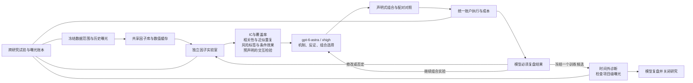

# V7 — 因子证据驱动研究框架

V7.0 把上一版研究程序接成有阶段约束的研究流程。模型保留机制推理、提出新公式、选择组合、解释反例与请求扩展的职责；程序负责重复计算、时间边界、试验记录、缓存和紧凑证据传递。



## 与 V6 / 上一版程序层的区别

| 事项 | 上一版程序层 | V7 |
|---|---|---|
| 研究入口 | 提交组合后计算因子报告 | 独立因子检验完成后才能提交组合 |
| 因子价值 | 有描述性 IC，但流程容易直接拼接 | 明确区分收益、风险、条件、交互；无高 IC 通用准入门槛 |
| 找到已有信息 | 文本查询与公式身份 | 增加参数形状近邻与训练期行为相关性 |
| 真实日历定义 | 大量目录记录，少量可计算 | 逐源核对接入 35 个标准日线定义，缺口保持可见 |
| 时间边界 | 部分校验先检查完整面板 | 数值与合法性校验前先裁到当前阶段截止日，保留此前历史 |
| 样本口径 | 因子统计与账户可选股范围不同 | 使用同一可选股范围，包含历史长度、成交额、ST 等条件 |
| 迭代反馈 | 预算可能用完而无模型复盘 | 前一批必须留下诊断才可继续，预留关闭调用 |
| 证据保留 | 部分报告在后续失败时难以检索 | 每个阶段立即登记证据边，失败亦有可追溯报告 |
| 试验记录 | 单研究目录账本 | 默认项目共享账本，保留跨目录尝试、重复与曝光 |
| 验证 | 同一开发区间内比较 | 冻结训练候选后才解锁后期数据；曝光过的区间不得称独立留出 |

## 入口与配置

独立包：`src/quanta_agents/meta_v7`；应用入口：`scripts/run_research_v7.py`。旧 `meta_v6` 与 `research_kernel` 继续保留。现阶段提供 Python API 与 CLI，没有宣称旧网页界面已经接通 V7。

```powershell
.\.venv\Scripts\python.exe scripts/run_research_v7.py init --root <study> --file <frozen_config.json>
.\.venv\Scripts\python.exe scripts/run_research_v7.py import-v6 --root <study> --source <prior_v6_study>
.\.venv\Scripts\python.exe scripts/run_research_v7.py import-calendar --root <study> --source <calendar_source_root>
.\.venv\Scripts\python.exe scripts/run_research_v7.py action --root <study> --file <factor_action.json>
.\.venv\Scripts\python.exe scripts/run_research_v7.py run --root <study>
.\.venv\Scripts\python.exe scripts/run_research_v7.py iterate --root <study> --steps 8
```

配置必须明确 `split_plan` 六字段：`train_start`、`train_end`、`validation_start`、`validation_end`、`embargo_sessions`、`max_label_horizon`。日期使用原始日历边界，避免把 1 月 1 日改成首个交易日而遗漏完整年度统计。训练标签的退出日不得超过训练截止日；净化末端标签与额外隔离间隔分开声明。

`data` 沿用已验证市场加载器参数，训练阶段强制把加载截止缩到 `train_end`。`project_root` 默认固定在本项目 `output/research/meta_v7_project`，真实研究应持续共用它；另开数据库不能洗掉已知历史曝光。`prior_exposures` 必须登记已知的旧研究范围。模型不能改变配置或数据授权范围。

动作采用三字段 JSON：`action`、`reason`、`payload_json`。新增 `evaluate_factors`、`review_batch`、`review_validation`；继续支持查询、注册因子、提交批次和能力扩展请求。软件生成哈希、路径、控制组、证据索引；模型不需要重复输出实验代码。

## 研究边界

- 语法可执行、数值一致、引擎测试通过、真实模型完成研究、独立样本有效、可交易收益成立，是不同验收层次。
- 单因子低 IC 不会自动剔除。条件与交互检验保留弱因子的辅助用途，但只检验显式声明的有限候选，不穷举所有因子组合。
- 相关性表示已有信息重叠的证据，不等于相同经济机制。当前近邻检索尚未覆盖整个库的持久化行为向量索引。
- 共享账本统计描述尝试与重复，不把它们冒充独立试验数输入 DSR。预声明配对区间也不能修复未登记的历史选择。
- 调整价格、历史成分和可交易约束继续沿用明确的数据合同；历史发布时间、公司行动现金流和完整可成交证明仍有限，不能因此宣称不存在所有未来信息或实盘摩擦。
- V7 支持任意已注册因子的安全表达式组合，算子不足时记录扩展请求。受限算子、非自动全库交互搜索、严格风险/暴露匹配组合控制与更多数据适配仍是后续扩展点。
- 真实模型小规模对照只能报告该预声明样本的发现率、误报、上下文与 token。它不能证明所有任务的模型上限已提高。

验收结果及实际范围见同目录 `ACCEPTANCE.md`，原始结果位于独立的 V7 验收目录。
