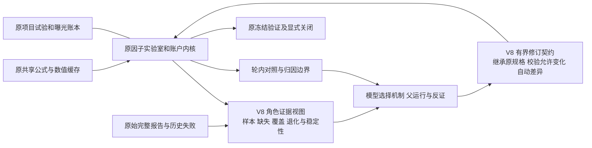

# V8 独立判断与实施冻结

日期：2026-09-09。本轮在读取 V7 原始账本、调用、因子报告及代码后作出判断；不是续跑已关闭的 V7 研究。旧源码、主记录与工作区状态保存在 `output/research/meta_v8_20260909/baseline_source.zip`、对应 manifest 和 baseline_git_status.txt。

## 判断与优先级

1. **已确认缺陷：反馈与修改未形成程序约束。** `meta_v7/controller.py::review_batch` 只要求非空结论；`submit_batch` 不绑定下一轮与被复盘的运行。真实第一轮称下一轮仅识别配置作用，第二轮却同时把 top_n 40 改为 20、risk epsilon 1e-6 改为 1e-8，并重写 score。第三次真实调用专门读取已存 control 规格。修订接口应继承指定 run，冻结允许修改范围；软件输出实际变化，模型决定机制、父运行与反证。这能减少重述与漂移，不能证明原亏损由漂移导致。
2. **已确认缺陷：摘要对角色证据的压缩不对称。** `protocol.py::compact_factors` 保留边际 IC 的样本数，却把 risk、interaction 压到均值，遗漏缺失、秩亏、覆盖与年度稳定性。相同均值可能来自一个有效日或上千日；未知不能与充分覆盖的弱证据合并。优先修复证据表示及定向取证，不设高 IC 准入阈值，也不强制模型选择弱因子。
3. **已知能力边界：风险比较不识别仓位独立增益。** `meta_v6/portfolio.py` 先归一化、再逐股截断上限且不重分配。top_n=20、cap=.05 时非均匀权重本就可能留现金。真实均仓约 88.46% 对 98.78%，V7 模型已主动拒绝独立风险增益。应显式报告控制能区分什么；本轮不更改资金分配器，不用已实现收益事后缩放构造可交易控制。
4. **能力边界与待验证假设：发现范围及长期复用。** 6 对交互并未展示明确可兑现优势，无法推断模型忽略了已成立 alpha。现有条件只含同日中位秩二分，不能代表所有时序状态或多因子机制。共享目录和账本也不是完整研究知识检索。先验证证据恢复与有界检索的收益，再决定大规模行为索引或搜索算法；库越大不等于发现越好。

V7 保留了原始失败、轮内对照、真实复盘、冻结后不再按后期结果重选，这些是有效设计。V5 的完整逐 cell 修订约束并非全部值得搬回：本轮只恢复父运行、证据和实际变更之间的最小连接，避免另建大量审计阶段。

## 结构变化

保留：表达式语言、数据范围、账户、缓存、项目谱系、恢复和强模型 gateway。新增模块留在现有 `meta_v7` 包中，用冻结 `research_profile` 选择 V8 行为；旧配置默认仍按 V7 运行。原结果不改写。V8 是可选择的研究接口演进，不复制执行内核。

合并：重复查询原策略和重新输出全部规格由受限修订替代。删除：V8 的风险/交互仅均值表示。暂缓：网页、全库适配、自动赢家、全面时序门控搜索、资金分配器改变、持久化全市场行为向量。

## 选中改动的可否证预期

| 改动 | 减少的不确定性/重复 | 可能代价 | 最低验证与停止条件 |
|---|---|---|---|
| 角色证据视图 | 区分弱效应、缺失和退化；避免为已保存样本信息重复查询 | 上下文变长，过多诊断可能分散判断 | 同均值不同样本/退化反例；旧真实报告无重算重放；在冻结输入上超过 32KB 或弱交互/负控决策退化则不验收成本/发现增益 |
| 父运行绑定修订 | 保留未声明参数；把复盘与下一次实验相连 | 限制跳跃式新构思，需要显式关闭旧假设再开分支 | 真实 40→20、epsilon 漂移可被指出；未声明变化必须拒绝；可合法改变多个参数但不称单因素；同一行动恢复不重复执行 |
| 控制解释 | 避免把缩仓回撤改善归因于风险信息 | 只能说明未识别，不能补出独立收益 | 使用独立生成目标权重反例和保存的真实账户；不生成事后可交易控制，不升级金融结论 |

## 验证分层及新预算

1. 本地工程、旧轨迹重放与统计反例：零付费、零旧账户重跑。生成数据明确标注，包含弱交互、冗余、无信号、低覆盖和退化，记录所有预先选定种子及失败。
2. 必要回归覆盖被改动模块与 V7/research_kernel 接口；不将测试数量视为研究样本数。
3. 在上述条件通过后，另存实际有界模型试验协议及所有输入哈希，使用 gpt-6-astra/xhigh。暂定总上限 **4 次新真实调用、零自动重试、每次 900 秒、输入 32KB、输出 12KB 生成后准入**；总墙钟上限 3900 秒。两个呈现/接口条件使用同候选、同训练证据与同决策预算；能力不同单列。至少包含生成诊断任务与真实 2016–2020 已存研究证据。若保存回执不完整，离线恢复，禁止补问。不得使用旧剩余额度。
4. 本轮默认新增市场账户预算为 **0**：当前最小问题是证据区分和修订有效性，可直接用旧真实数值检验，不应为补证明重复跑同一账户。若模型选择确有必要的新数值实验，须先另冻结该实验的具体候选、账户与时限，不能自动增加预算。
5. 本轮不能证明独立金融盈利或一般研究上限。2015 只作预热，2016–2020 训练证据；2021–2024 只用于已曝光失败诊断，不能回灌候选；禁止 2025 数值。旧实验目录保持只读，新记录继续关联原项目谱系。

若 V8 只能提高证据可审阅性、没有提高冻结任务发现或有效弃权，应直接记录该结果。若 token 增加，则记录成本增加；不能用减少一次可避免查询推算普遍节省比例。
