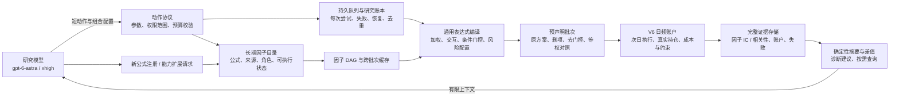

# 软件研究内核 v1

在 V6 数值引擎外新增持久程序层。模型提出研究问题、选择下一步、设计组合；程序执行重复工作并保留全部证据。旧 V6 源码和冻结研究记录保持原样。



模型接口提供六个动作：`query_assets`、`get_evidence`、`register_factor`、`propose_batch`、`request_extension`、`stop`。模型输出一个动作、简短理由和 JSON 载荷；不再反复生成执行脚本、文件路径、哈希、账户规则或整份研究历史。嵌套载荷使用字符串以兼容现有严格输出网关，随后由程序解析并验证。

新公式可用现有安全算子注册。组合可以使用任意已登记因子，而不绑定 F6/F7 等名称。排名和方向必须显式指定；弱单因子可以作为交互、条件或风险输入，没有统一的 IC 淘汰门槛。系统不会把语法通过、已入目录或合成测试通过称为因子有效。

持久身份包含规范公式、组合结构、实际面板内容、范围、账户政策、数值引擎源码和依赖版本。名称、说明和相同公式别名不会触发重复账户运行；每次提出的实验仍单独记录并计入尝试预算。去重覆盖规范语法和公式别名，不声称识别所有代数等价表达式。

因子分数按内容保存并校验，因子诊断可跨批次复用。批次的 `leave_one_out`、`without_gate`、`equal_weight` 对照在看到结果前生成。报告保留失败和负结果，并给出相对原方案的数值差。平均 IC、年度 IC 和因子间日截面秩相关是描述性证据；本版未实现多重检验校正，也不会自动宣称增量显著。

进程状态与研究状态分开记录。实际执行使用已有 Windows Job Object / 进程组监督器，限制时长和日志输出，退出时确认所属进程清理。OS 锁阻止双执行器；进程中断后，下一次 `run` 从冻结输入恢复，旧部分结果不作为完整账户复用。失败和重试都占用执行预算。单个策略算错或缺数据只阻断该策略；已有账户文件完整性校验失败会暂停整次执行，要求修复其证据。

完整明细留在本地证据库；上下文只带状态、最近结果、拒绝原因、目录页和证据 ID。更早失败可通过完整账本 ID 查询。过大的查询返回可定位的缩小查询提示，全文仍在证据库。输入按 UTF-8 字节设硬上限；输出字节上限在收到模型完成响应后验收，**不是供应商端的生成 token 硬上限**。真实用量来自原始完成事件，未知用量不伪装成零。研究模型仍固定为 `gpt-6-astra/xhigh`，本地运行配置验证与供应商算力证明分开。

## 使用

在项目目录使用现有 `.venv`：

```powershell
.\.venv\Scripts\python.exe scripts/run_research_kernel.py init --root output/research/my_study --file study_input.json
.\.venv\Scripts\python.exe scripts/run_research_kernel.py import-v6 --root output/research/my_study --source output/research/meta_v6_factor_calendar_20260909
.\.venv\Scripts\python.exe scripts/run_research_kernel.py register --root output/research/my_study --file new_factors.json
.\.venv\Scripts\python.exe scripts/run_research_kernel.py action --root output/research/my_study --file batch_action.json --id unique_request_id
.\.venv\Scripts\python.exe scripts/run_research_kernel.py run --root output/research/my_study
.\.venv\Scripts\python.exe scripts/run_research_kernel.py iterate --root output/research/my_study --steps 1
.\.venv\Scripts\python.exe scripts/run_research_kernel.py status --root output/research/my_study
```

`init` 冻结数据和预算，变更范围需新建研究。配置模板及当前验收输入位于 `output/research/research_kernel_acceptance_20260909/study_input.json`，里面的面板指纹由程序计算。`data` 使用现有 `load_market_panel` 参数名，其中数据根为 `data_root`。`register` 支持一个定义或定义列表；`import-catalog` 只导入目录元数据，未认证公式不会直接变成可执行资产。

`evidence --id ... --pointer /... --limit ... --offset ...` 查询证据；`context` 检查将要给模型的输入；`retry --id run_...` 显式重试失败或取消的实验；`recover-call --id model_...` 只从已保存的原始响应恢复，不再次付费调用。身份或完成证据不清楚的模型调用阻止新的隐式调用。账户队列恢复用 `run`。`stop` 停止研究，`cancel.request` 可以取消正在执行的进程；取消文件不会自动清除。

程序接口为 `ResearchKernel`、`AssetRegistry` 和 `execute_strategy`。它们可被现有应用服务调用；本版提供 Python API 和 CLI，尚未把控制台挂入现有网页前端。

## 当前边界

- 执行范围是已有 A 股日频、只做多、无杠杆账户，支持截面选股及持仓缓冲。自定义持仓年龄退出、盘中交易、其他市场执行模型需要实现并验证一次扩展；目前会明确拒绝，不会忽略配置。
- 新目录已导入旧 V6 的 12 个定义，其中 11 个可由通用引擎计算；HF0280 的专门三次截面残差算子保留为不可用。因子日历 415 条为可检索元数据，不等于 415 个已迁移函数，也不是 415 个独立因子。Alpha101 / Alpha191 的原始本地实现未在当前已核查范围定位，因此没有宣称接入。
- 原始 IC 不等于组合价值。交互/门控表达、对照生成、相关性报告已经具备；大规模分组检索、主动探索调度、多重试验校正、严格独立留出集晋级仍是后续功能。
- 本次只验收程序表达能力、数值一致性、恢复及上下文开销。所有真实市场数值属于已暴露的开发范围。程序验收通过不能证明年均夏普超过 1，也不能证明模型研究能力的统计上限已提高。

实际执行证据与验收结果见同目录 `ACCEPTANCE.md`。
