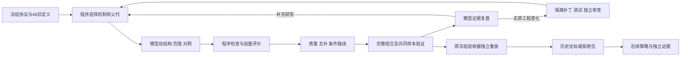

# QuantaAgents 元框架主记录

更新日期：2026-09-16。项目根目录：D:\大学\金融投资与量化\ai策略迭代开发\QuantaAgents。研究代码在 src/quanta_agents/factor_lab_a；研究根 F:\A_Layer_Research，样本外面板 F:\A_Layer_OOS，比赛实时数据与目标持仓 F:\A_Layer_Live（三者都在外置盘上，开工先确认已挂载，09-16 曾两次掉盘）。

## 项目说明（2026-09-16 现状）

**这是什么**：一个"程序负责枚举、改造、交叉、评价、组合、重放，模型负责诊断、剪枝、复盘"的 A 股量价因子研究框架（A 层），目标是交付可交易、样本外成立的截面选股分数与交易规则。V2—V10A 的旧框架（第 1—18 节）已关闭；2026-09-13 起按第 19 节的外部复盘重建为 A 层因子实验室，经 A11 → A15 五轮迭代（第 20—31 节）。**第 32 节是迭代总览、问题与修法、反思经验与现状，新读者从第 32 节进入。**

**当前主线两条，口径不同不能互比**：

| 线 | 版本 | 口径 | 2019—2024 | 前向确认（不参与选择） | 状态 |
|---|---|---|---|---|---|
| 研究目标线 | v13：全 A 可交易池，597 成员（日频量价 + 31 个日内字段），LightGBM 排名目标逐年扩展重训，5/10/20 日标签融合，缓冲带（进前 10%、跌出前 30% 才卖、5 日平滑） | 对全 A 可买池等权，单边 0.2% | 净超额 +22.3%，净夏普 2.82，六年最差 +17.8% | 2025 +22.9%；2026 年 1—5 月 −1.7% | 冻结，可独立重放（第 27 节） |
| 比赛线（兴证全球杯量化赛道，只做多） | c2：396 日频成员全 A 模型打分，限制在 沪深300 ∪ 中证500 ∪ 中证1000 成分内；中证500 桶 88% 按流通市值权重整桶持有、在换手五分档内剔除分数底部两成；其余并集桶 8% 前 25 名；现金 4% | 对中证500 价格指数，每边 0.2%，200 万整手 | 净超额 +4.6%，净夏普 1.35，最差年 +1.2%，十日窗口胜率 66% | 2025 约 −2%（毛 +1.8%）；2026 年 1—5 月 −2.4%（毛 +2.2%） | 日更链已跑通，09-18 起真实成交作样本外（第 28—30 节）；A15 增量研究进行中（第 31 节） |

**已证明与未证明**：六年历史与 2025 前向达标只对研究目标线成立；比赛线在研究期过修订后验收的三条、不过两条（六年均值与最差年），前向两段扣费后为负而毛超额为正；两条线都没有真实成交、容量与冲击成本的证据。成员准入的选择膨胀已量化为下界（第 25 节），组合层种子噪声已量化（第 31 节）。

**阅读导航**：第 1—13 节旧轮证据；第 14 节旧框架的迭代过程；第 15—16 节参考项目与案例反思；第 17—18 节 V10A 设计与来源边界；第 19 节外部复盘与 A 层重设计；第 20—23 节 A11 / A11.1 / A12；第 24—27 节样本外检验与 A13 三步；第 28—30 节 A14 比赛特化；第 31 节 A15；第 32 节迭代总览、反思经验与现状。各轮完整迭代记录在 docs/research/framework_review_20260913/，实验室操作说明在 docs/FACTOR_LAB_A.md，比赛日更流程与登记卡映射在 docs/COMPETITION_OPS.md。旧文中的"下一轮"只指当时阶段；F 盘上 V10A 的旧进程不恢复也不终止。

## 1. V7历史结论与交接状态（2026-09-09）

**V7.0 程序层与研究流程验收通过，本轮策略的跨期稳健性未通过。** 还没有证明独立可交易盈利、无过拟合或模型研究上限提高。

此前交接轮只整理主记录与续接 prompt。9月9日的续接轮随后按用户要求独立复核并开发 V8；旧 V7 研究仍然关闭。新验证使用独立目录和新冻结预算，不创建协调对话或监控。

2026-09-09 保存的核对：V7 研究 stopped=true，pending_stages=0；6 次模型调用，6 个训练组合账户完成，加冻结候选的训练复核及时间外账户，共 8 次账户执行。已完成两轮复盘与最终验证复盘。不能把尚余的名义预算当作重开已关闭研究的指令。

[新对话续接 prompt](D:/大学/金融投资与量化/ai策略迭代开发/QuantaAgents/docs/META_FRAMEWORK_V8_CONTINUATION_PROMPT_20260909.md) 是当时的V8交接入口，现用于历史追溯。旧主记录已逐字节归档为 [V5 历史快照](D:/大学/金融投资与量化/ai策略迭代开发/QuantaAgents/docs/research/meta_framework_history/master_before_v7_update_20260909.md)，SHA256：c8a4a04b7f3c146f9d9554451459a0444bb4fdcac45295f88a5c76f434f0b0c5。其中的“当前 V5”“正在运行”“本对话到此停止”等均属于当时快照，不能覆盖本次用户的新要求；原研究数据边界与失败历史仍须保留。

## 2. 用户希望框架具备的能力

- 以因子证据指导选股与组合。模型可以提出机制、创造新表达式、选择交互和反证实验；程序承担数据处理、批量计算、缓存、执行、记账和简短反馈。
- 既检验单因子 IC，也检验相关性、条件效应、风险用途及组合增量。低单因子 IC 不构成普遍淘汰理由；MA5 辅助案例是研究动机，不是已证明可泛化的规律。
- 建立长期可复用的因子与研究知识库，保留有效、无效、不可用及依赖条件，避免每个种子重新发明、重复计算。
- 用软件提高单位时间、上下文与 token 的有效研究产出，同时保留强模型的判断能力。不能只增加提示词、审计步骤、固定模板或更多角色。
- 把工程通过、发现能力、因果增量、泛化和真实执行收益分开验收。没有优势时允许弃权，不能以找到漂亮回测作为唯一停止条件。

## 3. 版本与实际代码关系

| 层次 | 位置 | 当前作用与边界 |
|---|---|---|
| V4 / V5 历史底座 | src/quanta_agents/meta_v3、meta_v5 | 原执行、来源、反思与年度诊断记录保留；并非所有旧约束自动继承到 V7 |
| V6 数值与资料层 | src/quanta_agents/meta_v6 | 版本字段 6.0.0-dev；因子计算、市场面板、账户、模型 gateway 和受控工作进程 |
| 前一版程序内核 | src/quanta_agents/research_kernel | research_kernel_v1；安全表达式、注册表、缓存、批次、账户及证据存储 |
| V7 研究程序 | src/quanta_agents/meta_v7 | 包版本 7.0.0，状态版本 meta_v7.0.0；因子先行、阶段约束、共享谱系与后期诊断 |
| V7 应用入口 | scripts/run_research_v7.py | Python API / CLI；旧策略默认配置仍为V7，旧网页入口尚未完整接通 |
| V8 研究接口 profile | 同一 meta_v7 包内的 decision_evidence.py、revisions.py，以及 controller/protocol 集成 | 角色证据视图与父运行绑定修订；状态版本 meta_v8.0.0-dev。未复制数值内核，基础包 __version__ 仍为 7.0.0 |
| V9策略研究 | src/quanta_agents/meta_v9；scripts/run_research_v9.py | 已验收9.0.1，原策略研究已关闭；不等于范围搜索分支已验收 |
| V9.1范围搜索分支 | meta_v9/ranges.py、batch_compute.py、range_study.py；scripts/run_research_v9_ranges.py | 代码已写入，完整运行及缓存/原路径等价验收仍未找到；单列待验证 |
| V9A独立因子研究 | src/quanta_agents/factor_research；scripts/run_factor_research_v9a.py | meta_v9a.1.0，独立FactorStudy，通过适配器复用内核；研究已关闭 |
| V10A持续因子/组合研究 | src/quanta_agents/factor_campaign；scripts/run_factor_campaign_v10.py | 仓库初始包字段10.0.0；活动指针指向F盘隔离的10.0.1维护副本，不能只读仓库包字段判断运行版本 |

V7 基于旧数值能力扩展，没有为改名复制整套执行内核。旧运行的冻结源码、账本和原始结果不能被覆盖成新版本。仓库有大量已有未提交内容，不能重置、清理或覆盖不属于当前修改的文件。

## 4. V7 的实际流程

~~~mermaid
flowchart LR
    A[冻结数据与历史曝光] --> B[共享因子库与缓存]
    B --> C[独立因子检验]
    C --> D[模型提出组合与对照]
    D --> E[统一账户与完整结果]
    E --> F[模型必须复盘]
    F -->|修改假设或组合| C
    F -->|冻结训练候选| G[后期数据准入与诊断]
    G --> H[最终复盘并关闭]
    L[项目级试验与曝光账本] --- C
    L --- E
    L --- G
~~~

| 模块 | 已实现的责任 |
|---|---|
| temporal.py / execution.py | 在表达式与账户校验前截断未来数值，保留此前历史；因子诊断与账户使用同一可选股范围 |
| factor_lab.py | 独立 IC、覆盖率、年度诊断、角色风险标签、相关性、显式条件与交互检验；标签与交易输入分离 |
| assets.py | 共享定义与数值缓存；已核对日历适配；参数形状近邻与训练期相关性 |
| ledger.py | 项目级不可变试验、尝试与曝光记录；验证读取前原子检查并登记曝光；计数不冒充独立样本数 |
| controller.py | 因子报告先于组合、前一批复盘先于下一批；保存各阶段与失败证据；冻结候选和共享账户预算 |
| validation.py / benchmarks.py | 净化训练末端标签、时序分段、固定候选诊断、配对日期块区间、合成发现任务 |
| protocol.py / model.py / cli.py | 按阶段缩减上下文、模型原响应保存与恢复、强模型身份准入、调用上限及收尾保留 |

“已有因子报告”和“非空复盘”只是阶段准入，不能直接证明因子适合当前用途或推理正确。接手时应核实研究结论与后续实验的实际联系，不能假设 V5 的所有引用、反证和修订绑定约束已经完整迁移。

## 5. 已完成验收：分别计数

| 验收层 | 已保存结果 | 不能推出的结论 |
|---|---|---|
| 最终工程回归 | 319 项通过，0 失败、0 错误、0 跳过；覆盖 V7 和 research_kernel | 全仓库测试全部通过、319 次策略实验、策略盈利 |
| 固定策略数值比较 | 新旧各跑训练与后期账户，共 4 个；日表、交易、年度与目标逐值一致 | 一般策略无未来信息或框架提高发现能力 |
| 真实 V7 研究闭环 | 12 因子、66 对相关性、6 对显式交互；6 模型调用、两轮组合、8 次账户执行 | 独立样本有效或任意想法都能盈利 |
| 同条件呈现 pilot | 2 种子 × 2 模式，共 4 次真实模型调用；两模式都发现 4 个合成来源并拒绝 2 个噪声任务，无误报 | 完整 V6/V7 因果比较、一般研究上限提高 |
| 模型配置 | 上述真实调用均核对本地 gpt-6-astra / xhigh 运行记录 | 供应商服务端计算身份独立认证 |
| 进程关闭 | 真实研究 4 个数值工作进程完成并确认所属子进程退出；6 个模型进程退出码 0 | 其他历史任务当前状态 |

最终测试记录是 2026-09-09 的已保存验收，本次文档更新未重跑测试、模型或账户。固定数值比较 4 个账户与真实闭环 8 次账户分开计数；呈现 pilot 不执行真实市场账户。

## 6. 真实研究结果与失败边界

研究目录：[research_study](D:/大学/金融投资与量化/ai策略迭代开发/QuantaAgents/output/research/meta_v7_acceptance_20260909/research_study)。

第一轮提出动量、反转与逆波动组合并做删项/等权对照，原组合训练累计收益 -5.35%。模型据对照否定当前反转组件的增益，指出低相关不保证互补。

第二轮检验纯动量的逆波动与等权配置。回撤改善伴随仓位下降，配对 Sharpe 区间含零；模型没有认定 F7 的独立增益，按简约性冻结等权候选。第二轮持股数由 40 改为 20、风险 epsilon 也改变，因此跨轮不能解释成单因素实验；每轮内部自动生成的控制组仍保持其他参数一致。

| 冻结等权动量候选 | 2016–2020 训练 | 2021–2024 已曝光后期诊断 |
|---|---:|---:|
| 累计净收益 | 137.90% | -44.02% |
| 全期净 Sharpe | 0.723 | -0.523 |
| 年度净 Sharpe 均值 | 0.675 | -0.563 |
| 最大回撤 | 36.69% | 61.37% |

模型最终否定该候选的跨期稳健性，保留负面与缺失证据并关闭，没有按后期结果继续改参重选。后期失败是真实观察；它本身不能定位为过拟合、因子无效、组合方法或框架设计中的某一个原因。

账户为既有复权单位开发近似，仍有历史发布时间、公司行动现金流、陈旧估值及真实成交认证限制。全期 Sharpe 与年度 Sharpe 均值分别报告，不能替换口径。

## 7. 效率与真实运行中修复的问题

真实研究共输入 94,362 token、输出 8,439 token，总计 102,801；reasoning output 6,504 是输出的子集，不能重复相加。不同任务的因子数、轮次及验证范围不同，不能直接用总 token 宣称版本效率改善。

同条件小规模呈现 pilot 中，原始逐日证据模式总 token 为 41,868，程序摘要模式为 27,768，减少约 33.68%。两模式候选能力、训练数字和预算上限一致，只有证据呈现方式不同。该结论局限于两个种子、强信号合成任务；第二种子的冗余因子选择了不同但同源的代理，不是所有决策逐项相同。

真实闭环曾两次在新模型调用前触及 32KB 上下文上限，原因分别是复盘重复完整发现摘要、下一轮选择重复已复盘账户细节。已修为按阶段保留所需细节和完整证据索引，并补生成数据回归；已完成的回答与账户没有重算。修复后的实际上下文为 19,437 与 27,441 字节。必须保留这段失败记录，不能把全过程描述为从未中断。

收尾保留按模型调用次数控制，不能称为全研究绝对墙钟期限。输出字节限制是生成后的准入，不是供应商 token 硬上限。

## 8. V7因子库快照与后续判断入口

共享库与账本：[meta_v7_project](D:/大学/金融投资与量化/ai策略迭代开发/QuantaAgents/output/research/meta_v7_project)。

- 46 个可执行定义：原 11 个，加逐原函数验证接入的 35 个日历日线定义；可执行不等于独立信息源或有效 alpha。
- 55 个明确不可用定义，保留算子、状态初始化或字段缺口，不静默近似。
- 415 个仅元数据条目。它们在真实研究关闭后补入，未参与本轮数值选择。
- 合计 516 条目录记录，不等于 516 个独立因子，更不证明 Alpha101、191 或全部“365 因子”已经迁移。用户提及的各源需分别核对定义、映射与运行状态。
- 已共享公式、数值缓存与项目试验/曝光记录；完整跨研究证据检索、持久化行为索引与主动多样性搜索尚不完整。换研究目录不能洗掉旧曝光。

V8 应独立判断：当前瓶颈是可计算因子覆盖、知识检索、搜索选择、表达能力、研究反馈、组合归因，还是数据中本就缺少优势。历史建议只是待评估选项，不能直接当成既定架构。

## 9. 数据与正式结论边界

当前 V7 已使用/已知曝光的数值范围是 2015–2024：2015 作历史预热，2016–2020 作训练开发，2021–2024 作已曝光时间外诊断。2025 本轮只允许来源、日历、文件元数据，不得顺手加载其价格、标签、因子数值或账户结果。旧 V5 文档关于 2024 本地封存的说法不能再用来声称当前 2024 未曝光。

来源为 D:/qlib_data/parquet_cn_a_qfq_tradeable_v2_2015_2025，使用沪深300历史成员完整并集、信号日资格和冻结日历。数值加载的逻辑日期范围不等同于 Parquet 物理页完全隔离。

时间截断、正向标签净化、不可用值保留和禁用未来表达式的测试已通过；上游历史可得时间与完整执行认证仍有限。因此不能写“已证明无未来函数或无过拟合”。

原正式目标与历史验收合同保留在历史快照第 12 节：包括真实成本后冻结样本外净 Sharpe 严格大于 1、足够持续交易与退出样本、风险门，以及有依赖处理的多案例、多机制、原始重复架构评估。它们没有因 V7 软件验收而达成；历史 54 次启动规模也不是下一轮自动调用预算。新的 V8 有界实验应先声明自己的问题、比较口径、成本与数据范围，不能降低旧门槛后回写正式成功。

## 10. 当时V8续接的阅读入口与工作原则

以下保留V7→V8当时的阅读顺序。当前V10A续接先读本文件开头和第17节，再沿具体问题查证据，避免按旧交接重跑完整研究。

1. [V8 续接 prompt](D:/大学/金融投资与量化/ai策略迭代开发/QuantaAgents/docs/META_FRAMEWORK_V8_CONTINUATION_PROMPT_20260909.md)。
2. [V7 架构与 API](D:/大学/金融投资与量化/ai策略迭代开发/QuantaAgents/docs/research/meta_framework_v7/README.md)。
3. [V7 完整验收与限制](D:/大学/金融投资与量化/ai策略迭代开发/QuantaAgents/docs/research/meta_framework_v7/ACCEPTANCE.md)。
4. [发布验收机器记录](D:/大学/金融投资与量化/ai策略迭代开发/QuantaAgents/output/research/meta_v7_acceptance_20260909/release_acceptance.json)。
5. [冻结研究配置](D:/大学/金融投资与量化/ai策略迭代开发/QuantaAgents/output/research/meta_v7_acceptance_20260909/research_input.json)、[最终测试 XML](D:/大学/金融投资与量化/ai策略迭代开发/QuantaAgents/output/research/meta_v7_acceptance_20260909/pytest_release.xml)。
6. [呈现 pilot 原始报告](D:/大学/金融投资与量化/ai策略迭代开发/QuantaAgents/output/research/meta_v7_acceptance_20260909/pilot_representation_001/pilot_report.json)。

模型完整上下文、动作、用量、原始会话在 research_study/model_calls；各阶段证据在 research_study/evidence；账户、验证原件和工作进程记录在该研究目录相应子目录。只在具体推理或实现问题需要时深入读取，不能用摘要取代存在争议的原始证据。

下一轮应先给出“已确认问题 / 待验证假设 / 暂不值得做”的判断，再选择少量有可证伪预期的高价值改动。对模型输出、行为偏差、软件约束和金融结果分别归因。不要只增加审计项或测试数量，也不要因局部税务/资料缺口而停止所有独立的因子与组合工程工作。

后续更新本文件须注明代码版本、事实时间、证据路径、验收层次及未完成项；不复活旧任务，不重写历史，不自动建立跨对话协调或监控。

## 11. V8 续接轮：独立判断与有界开发（2026-09-09）

完整入口：[V8 实现与使用说明](D:/大学/金融投资与量化/ai策略迭代开发/QuantaAgents/docs/research/meta_framework_v8/README.md)、[独立判断和架构设计](D:/大学/金融投资与量化/ai策略迭代开发/QuantaAgents/docs/research/meta_framework_v8/DESIGN.md)、[分层验收](D:/大学/金融投资与量化/ai策略迭代开发/QuantaAgents/docs/research/meta_framework_v8/ACCEPTANCE.md)。所有新证据位于 `output/research/meta_v8_20260909`。

独立复核确认：第三次真实调用已取到父对照规格，但第四次上下文只收到窄查询索引；复盘未绑定下一轮实际变更，出现40→20股及epsilon变化。score正缩放另有语法差异，不等于新预测信息。风险/交互原支持信息存在但未送达；逆波动回撤差异伴随缩仓，原模型已经正确指出不能认定独立风险增益。没有证据证明其忽略了已成立的真实日历alpha。

V8通过冻结 `research_profile="v8"` 选择新行为，旧配置默认仍为V7。保留数值与账户内核，增加角色证据视图和父运行绑定修订，接回原API/CLI；有界变化、实际差异及中断恢复由软件处理，机制、父运行、反证及新分支仍由模型决定。全库扩容、自动穷举、完整跨研究知识检索、时序共同状态和网页均未实现；分别属于未验证优先级或能力边界。

最终相关回归379项通过（旧319 + 新60），原因子154条统计及支持逐值一致。三个真实阶段的整包重放28,405/30,553/31,289 bytes，均低于32,000，旧研究文件及SQLite/WAL未改变。此前过大视图、上下文边界失败和修订半写入失败完整保留；通过结果不能覆盖失败历史。

新真实模型验证已在 `model_pilot_001` 完成4次gpt-6-astra/xhigh调用并关闭，四次本地身份验证、退出码0，零重试、新增市场账户0。两模式生成题选择完全一致：4/4预设来源、1个纯噪声误报、3/4正确弃权，没有显示发现优势。V7总token27,312，V8为31,655，增加15.90%，不能称效率改善。两者真实归因一致且正确；V8规格题因pilot未声明斜杠路径约定而被严格拒绝，该接口相对比较记为not_evaluable，不直接归因于生产接口失效。原invalid结果保留；未来pilot合同已修正且11项定向回归通过，未补付费调用。修前54项源码/输入和原report/intent已归档，四次原回答及用量再次核验。后者是同一真实2016–2020训练记录上的指定规格题，不是自主发现新市场策略。旧准备目录 `model_pilot` 在零调用时废止并保留。

旧V7的stopped=true、pending_stages=0仍有效；新有界评估也已关闭，剩余调用预算0。本轮没有恢复旧研究、创建协调对话、监控、交易、发布或扩大2025数据权限。V8保留为可选实验profile；金融成功、一般发现优势及成本优势均未验收。下一步优先研究弱信号/噪声区分、主动搜索或跨研究检索是否带来实质增益，先冻结可判别对照，不因版本名称默认升级或扩大付费规模。

## 12. V9：库内因子组合研究与后期失败（2026-09-09）

用户当时授权制作V9并基于库内有效因子设计策略。该轮验收版本9.0.1；入口为[使用说明](D:/大学/金融投资与量化/ai策略迭代开发/QuantaAgents/docs/research/meta_framework_v9/README.md)、[冻结设计](D:/大学/金融投资与量化/ai策略迭代开发/QuantaAgents/docs/research/meta_framework_v9/DESIGN.md)、[验收与结果](D:/大学/金融投资与量化/ai策略迭代开发/QuantaAgents/docs/research/meta_framework_v9/ACCEPTANCE.md)、[策略规格说明](D:/大学/金融投资与量化/ai策略迭代开发/QuantaAgents/docs/research/meta_framework_v9/STRATEGIES.md)。

沿用行情/表达式/账户/曝光账本，新增按日期等权的岭回归组合、辅助主效应与同样本交互对照、每时间折筛选/重拟合、全池等权账户归因、持久化V9闭环。模型声明机制和最多两对交互、选择方法、复盘；程序估计系数并执行账户。冻结46可执行材料全部算出训练数值，40项return角色参与基础筛选，不把516条目录称可用因子。2015预热，2016–2020开发，三折2018/2019/2020检查；2021–2024仍是已曝光诊断，2025数值权限未扩展。

15个开发账户完成。增加辅助主效应的ridge_augmented三个年度净收益-22.66%/30.19%/30.21%，同池基准-23.58%/25.30%/13.51%，据此冻结为诊断候选。最终6基础为F1、F3、QST、20日短期反转、TMA、F2，辅助为Amihud、VHF。F2×Amihud系数方向与预期相反，交互方法也没有稳定相对主效应增量，原联合交互假设被否定。

2021–2024冻结候选净收益-40.02%、全期净Sharpe -0.753、最大回撤56.24%；同池基准+5.84%、Sharpe 0.014、回撤14.68%；候选双倍成本净收益-52.65%。候选四个年度均弱于基准，模型最终reject并关闭，未按后期结果重选或改参。平均实际仓位75.44%/64.52%未匹配，账户仍保留复权单位、历史时点、开盘成交近似和未实际末端清算的限制。

9.0.0曾漏传最终拟合成功状态，导致真实模型因证据缺失拒绝；原目录study保持关闭，20项原源码/输入及初次核验另存。9.0.1在study_context_repair显式续接，只修上下文并复用原15账户和全部原拟合规格；原两次调用计入分母，总模型预算3→4、账户上限18未变。最终共18账户、4次gpt-6-astra/xhigh真实调用、61,492 token，含原失败成本。447项相关回归及修复后16项定向检查通过（有重叠）；18账户逐日/逐笔独立复算通过，继承171个文件双端哈希一致。

原件位于output/research/meta_v9_20260909，最终机器验收为release_acceptance.json。研究已关闭；软件与证据链通过不等于策略成功或V9比V8更省。后续值得检验的是成本/换手进入学习目标、训练关系跨期稳定性及信息来源扩展；本轮没有完成它们的对照，不能凭失败直接宣布某个改进方案已经成立。

## 13. V9A：独立因子研究与年度目标未达（2026-09-12）

本轮完成 `meta_v9a.1.0` 独立入口及两轮真实有界研究。主任务 Astra ultra 与三个 Astra xhigh 子代理实际启动，原生回执核验通过。程序负责展开、缓存、统计、固定增量、计账、冻结/恢复/导出，模型负责结构和机制节点。沿用旧数据/DSL/固定Ridge/账本；账户不在因子核心执行。

2015预热，2016—2018训练固定方向及基线，2019—2020开发，冻结后一次确认2021—2024。目标为2019—2024六年各自的原始单因子Pearson IC≥0.10；标签为下一开盘起五日未排名收益，每年末六个信号日按当年完整退出剔除。历史信号日沪深300池一致用于内部排名和评价。所有时期均已曝光，2025数值未加载。

初批现有库/规则扰动/模型新结构各12主尝试，开发反馈后增加12结构主尝试。总计96尝试（48主+48控制）、69唯一公式，27重复保留，全部公式执行成功。固定预测器比较45开发+5确认；冻结5个候选，确认访问1次。初批等预算原件与额外修订预算分开，不能凭累计最优宣布框架优势。原47规范记录和所有负面证据未改变；一对不同公式身份数值相同，身份数不是独立信息量。

开发排序最佳的路径一致性动量，2019—2024年度Pearson IC为+0.02029/+0.05696/−0.01655/−0.03224/+0.02751/+0.00301。5候选全部拒绝六年逐年0.10目标。原F1的固定预测器增量从开发+0.02762降至确认+0.00011（95%区间跨零）。工程完成、局部开发改善与历史跨期目标分别评价；本轮未证明独立稳定性或策略盈利。

综合工程回归137通过；真实面板缓存/原路径/批量/截断等价通过。独立手写前三因子22,026项、固定B/B+F1增量4,907项、最终5包65,910项复算通过，最终最大差2.22e-16；独立重建全部69开发汇总和冻结顺序一致。5包本机重导入数值一致，研究状态为 rejected_annual_0.10_target；本机绝对源码路径迁移仍有限制。

数值研究墙钟630.14秒、CPU580.41秒，单工作进程；模型实际token与存储按[COSTS.json](F:/V9A_Factor_Research_20260912/COSTS.json)时间戳，覆盖开发及审计团队。缓存输入/推理输出是子集，不能重复相加；货币费用和供应商请求次数无账单凭据，保持未知。额外付费gateway调用0，账户0。未证明相对旧版本的成本优势。

[完整验收](D:/大学/金融投资与量化/ai策略迭代开发/QuantaAgents/docs/research/meta_framework_v9a/ACCEPTANCE.md)、[逐年完整报告](F:/V9A_Factor_Research_20260912/FINAL_REPORT.zh-CN.md)、[机器验收](F:/V9A_Factor_Research_20260912/release_acceptance.json)、[因子包清单](F:/V9A_Factor_Research_20260912/study/bundles/manifest.json)。原件、原始会话、源码保护和失败都在 F:/V9A_Factor_Research_20260912。本轮已关闭，不把确认反馈用于继续生成；旧V7/V8/V9仍关闭、旧预算未恢复。进一步独立证据需要另行事前协议与合法数据权限，本轮不自动开启。

## 14. 迭代过程：问题如何改变了我们的开发方向

这条路线经历了从“让模型提出策略并回测”，到“用证据推动结构修订”，再到“独立研究因子、恢复组合并扩大有界探索”。版本增加不是研究能力提高的证据；每一步都要说明解决了什么、还缺什么。

| 阶段 | 当时发现的问题 | 采取的调整 | 结果与留下的反思 |
|---|---|---|---|
| V2研究循环 | 有研究规划与诊断工具，但候选节点看到的证据较压缩；局部参数改动容易被描述为自主机制发现 | 明确竞争解释、预注册、研究/确认/最终评价分工，讨论把诊断接回后续行动 | volume/MA5案例的条件来自既有输入，不能称自主发现；20分钟事件收益还受A股T+1约束 |
| V3/V4恢复与结构迭代 | 完整模型回答可能在网关重连后被误记为失败；失败容易导致重复调用；参数微调替代结构修订 | 回执恢复、失败审计、执行与来源检查、有界结构分支及研究轨迹 | 保存失败与成本，并验证恢复；任务启动、接口完成、研究成功分别报告 |
| V5年度与资产诊断 | 聚合指标掩盖年度退化、不同股票群体表现；复盘与下一实验联系不足 | 年度×资产诊断、完整证据读取、匹配基准、反思与实验绑定 | 已保存391项工程检查与c007回算，暴露过的案例仍不满足资格；更多诊断不自动产生alpha |
| V6/内核/V7 | 资料、公式、账户与控制器耦合；候选之前缺少统一因子证据 | 抽取数值内核，因子先行、共享注册/缓存/曝光账本，模型在节点决策 | 319项工程检查；真实候选后期净收益−44.02%，跨期稳健性未通过 |
| V8 | 父规格没送到后续上下文，跨轮改了多个变量；已有风险/交互信息未充分送达 | 角色证据视图、父运行绑定、允许变更及半写入恢复 | 379项检查；小pilot发现/弃权无增益，token增加15.90%；接口题合同缺口使该项not_evaluable |
| V9.0.1 | 不能只靠LLM猜权重，需要评价现有材料的组合用途 | 训练筛选、Ridge拟合、主效应/交互对照、时间分折、完整账户 | 18账户、4次模型调用；后期净收益−40.02%，逐年信号及头部毛收益失效；最终reject |
| V9.1范围分支 | 每个参数点消耗上下文，程序计算能力利用不足 | LLM给范围，程序共享缓存、批量账户计算与机械收窄；轮内LLM调用0 | 实现存在，缺完整运行验收；且搜索对象仍主要是权重、持股数、调仓等策略参数 |
| 9月12日外部项目学习 | 记录和审计较完整，但新因子创造、下一研究对象选择与经验复用不足 | 剖析RD-Agent与三个Alpha框架，重放RD-Agent公开demo；重新设计因子阶段 | 决定共享底层、分离FactorStudy；外部模型IC不能替代我们的原始因子IC |
| V9A | 同时开放因子、组合、择时、仓位会使归因困难 | 独立因子流程，保留有限固定组合增量，先最小框架验证后真实研究 | 69唯一公式、5确认包全部拒绝旧目标；证明了计算闭环，未证明年度IC或独立稳定性 |
| V10A | 用户指出实验规模太小、旧库合理因子利用不足、组合研究被弱化 | 全46旧定义重评，新增/父代/条件路线与完整组合研究，每版最低300因子/200组合 | 新目标及口径单独冻结；当前100/76，未达最低规模，也未达金融门槛 |
| V10A 10.0.1维护 | 真实运行发现排序挤占组合覆盖，复盘缺少成员、公式和配置证据 | 保存原声明，单独冻结覆盖执行顺序，补足上下文和依赖保护，独立审查后切换副本 | 163项去重工程检查；继承原结果和预算继续推进，不能把维护激活称新金融成果 |

早期背景见[旧主记录](D:/大学/金融投资与量化/ai策略迭代开发/QuantaAgents/docs/research/meta_framework_history/master_before_v7_update_20260909.md)、[研究边界](D:/大学/金融投资与量化/ai策略迭代开发/QuantaAgents/RESEARCH_LOOP_V2.md)、[V5实现](D:/大学/金融投资与量化/ai策略迭代开发/QuantaAgents/docs/research/meta_framework_v5/README.md)。后期数值以第5、11—13节及V10A机器记录为准。各轮工程测试范围有重叠，不能加总成一次完整验收。

两次方向修正需要保留：V9A把账户研究移出核心是为了清楚判断因子，不意味着组合不重要；V10A扩大规模和恢复组合是在其失败及用户反馈后补足研究空间，也不能把更大搜索量当成更有效信息。因子、组合、策略应分层衔接，不能在两端之间反复遗漏中间层。

## 15. 学习参考的其他项目：流程、取舍与实际证据

以下记录的是2026-09-12已完成的学习，使用当时固定源码和论文版本；本次重新读取本地报告，没有刷新上游版本或声称缺陷仍存在于最新提交。它们是模块参考，不是已经部署的依赖清单，也没有统一条件下的框架能力排名。

### 15.1 四个重点研究框架

| 项目与固定版本 | 实际研究流程 | 借鉴内容 | 已确认限制与我们的取舍 |
|---|---|---|---|
| [RD-Agent](https://github.com/microsoft/RD-Agent/tree/32b3d395e73d9db5eee3fe9063d69aec0fdc83bd)，32b3d395 | 外循环选择因子/模型方向→假设与任务→Co-STEER实现/修复→Qlib训练与评价→反馈 | 研究外循环与实现内循环分离；失败轨迹、相似成功实现和修复经验检索；受控开发入口 | 默认test指标进入研究反馈；Bandit及上下文存在具体缺陷。保留分层思想，指标/调度须独立验证 |
| [AlphaAgent论文分支](https://github.com/RndmVariableQ/AlphaAgent/tree/1da96e94a06a925c3997899f1848899440585efe)，1da96e9；[main快照](https://github.com/RndmVariableQ/AlphaAgent/tree/b42cb397025510da44355db9dcf278304321f589)，b42cb39 | 旧版假设→2—3公式→约束检查→计算/修复→模型回测→反馈；新版为FactorMiner调用评价与入库工具 | 机制到公式的输出契约、算子字典、复杂度诊断、相似邻居说明、因子库工具 | 旧版默认参考库为空，子树门槛不能保证原创性，修复后未重走原约束；新版能力不能回填为论文版已有 |
| [QuantaAlpha](https://github.com/QuantaAlpha/QuantaAlpha/tree/b7ceb27b1001261d7a95b209a963664ae1f8ab23)，b7ceb27 | 多方向规划→各自研究→保存轨迹→选父代→变异/交叉→再运行 | 父代、修改意图、失败原因、结果差分和有界轨迹摘要 | 当前多为父代摘要驱动重跑，未实现论文式精确局部轨迹编辑；最终handler的list/tuple切片缺陷已探针确认 |
| [AlphaPROBE](https://github.com/gta0804/AlphaPROBE/tree/872299dc9841f3c3096a2786fe976a2e2e1ad23f)，872299d | 种子入图→程序挑父代→带祖先公式生成子代→程序枚举窗口→质量/互补准入 | 有限预算挑研究对象，族级尝试与深度惩罚，质量提升和互补双路线 | 图索引不一致、单子代评分退化、修复表达式未实际使用、组合选列问题；重写并验证关键算法，不直接接入原评分器 |

RD-Agent的原函数探针确认：收益键末尾空格使标准12%读成0；按负数回撤口径会奖励更深回撤；简单后验更新给出0.833333而标准结果为0.666667。名为sharpe的量实际是收益/回撤，另有SOTA键名大小写及重复后端调用路径。这些是固定代码的局部或静态证据，没有量化其对整个论文结果的影响。详见[源码审计](D:/大学/金融投资与量化/ai策略迭代开发/QuantaAgents/docs/research/rd_agent_review_20260912/AUDIT_NOTES.md)及同目录探针。

AlphaAgent的公共子树检查能提示结构相似，不能证明新增经济信息。例如已有均线表达式仍可能因子树节点少于阈值而通过；套额外RANK也可能改善复杂度评分却不增加信息。主分支作者案例“日内减隔夜收益→平滑/缩尾/中性化”与我们的F3同属已知机制，应以同样本逐项对照检查增量，不能按新名称算原创。详见[AlphaAgent报告](F:/AlphaAgent_Review_20260912/REVIEW.zh-CN.md)。

QuantaAlpha需分开版本与指标对象：论文v1曾报IC0.1501、ARR27.75%；v3为IC0.0472、ARR4.68%，属于因子池经LightGBM的模型预测和策略结果。本次没有复现这些收益。当前配置已分开2021挖掘反馈与2022—2025最终回测，这是实际改进；但切片探针说明配置日期还需验证实际返回行。所谓机构动量案例只用价量代理，也不能据名称认定观测到机构行为。详见[QuantaAlpha报告](F:/Factor_Framework_Review_20260912/QuantaAlpha/REVIEW.md)。

AlphaPROBE每父代主生成一次模型请求，默认五个候选，窗口5/10/20/30交给程序展开。多个角色名称没有对应多次独立审查；其“Bayesian”检索也不能当作已校准的成功概率。作者附录公式的ICIR0.2652对应未来20日收益，不能与我们的五日Pearson IC比较。详见[AlphaPROBE报告与探针](F:/Factor_Framework_Review_20260912/AlphaPROBE/REVIEW.md)。

[三项目总对照](F:/Factor_Framework_Review_20260912/COMPARISON.zh-CN.md)保存逐阶段提示词、源码定位、作者案例和issue证据。直接源码移植还需核对具体提交的许可；当时若干快照只有MIT声明/徽章而缺独立LICENSE，不能拼接不同分支许可。

### 15.2 RD-Agent作者案例：真正运行了什么

完成的是作者**2024公开demo**前两轮固定因子重放：4组条件×5个预先声明种子，共20次LightGBM训练，另做3次作者模板默认参数检查，合计23次。不是2025论文最终因子库的严格复现，也没有用Astra重新生成因子；三个Astra xhigh子代理用于研究审查。

| Alpha158输入方案 | 本地五种子平均模型Pearson IC | 相对匹配列序基准的平均增量及95%区间 |
|---|---:|---|
| 原始列序基准 | 0.046456 | 不与列序变化混淆 |
| 排序列序基准 | 0.046227 | 新增因子实验的匹配基线 |
| 增加10日波动率 | 0.046761 | +0.000534；[−0.000552, +0.001438] |
| 增加10日与30日波动率 | 0.046220 | −0.000007；[−0.001033, +0.001096] |

两个区间都含零，尚未证明稳定增量。原始波动率单因子IC仅约0.01108/0.01141，不能把模型约0.046的IC归给它们。五种子共用市场历史，也不是五份独立金融样本。

该重放使用2008—2014训练、2015—2016验证、2017—2020评价，标签为次日至再次日收盘收益；我们V9A/V10A使用2016—2018方向/训练、2019—2024评价和次日开盘起五日收益。股票样本、标签、基线、模型和搜索预算不同，不能直接用IC高低裁定哪个框架更好。原拟议的“我们用相同初始条件跑”对照后来被用户取消，没有完成一场公平框架比赛。

作者第12轮demo的IC约0.07317另有明确问题：“情绪”由随机数生成，回归器用全段收益拟合并回填历史。追加未来数据后，三只股票各2,432个历史拟合值全部变化。该诊断确认了这段源码的时间泄漏，尚未测定其对0.07317的贡献，也不能据此否定整个RD-Agent项目。前两轮10D/30D的整段/截断值则一致。

[完整重放报告](F:/RD_Agent_Reproduction_20260912/REPORT.zh-CN.md)保存原代码、协议、模型、预测、逐日IC、标签和哈希；[高IC案例审计](F:/RD_Agent_Reproduction_20260912/author_materials/HIGH_IC_ROUND12_STATIC_AUDIT.md)保存泄漏证据。缺少作者旧数据快照、原依赖和种子，因此只能称有差异声明的重放。

### 15.3 更广的参考清单与适用范围

以下是当时广泛比较中保留的方向性参考，未全部部署或复现。对于不在当前日线因子主线中的模块，保留索引，按具体问题再验证。

| 项目 | 学习对象 | 当前取舍 |
|---|---|---|
| [Qlib](https://github.com/microsoft/qlib) | 数据/表达式、模型基线、滚动训练、实验记录 | 通用底座优先复用；标签、历史可得性、截面采样、基准权重与A股执行仍需对齐 |
| [Freqtrade/FreqAI](https://www.freqtrade.io/en/stable/freqai/) | 滚动训练、模型过期、预测留档、模拟运行、lookahead-analysis | 学其保存“当时产生的预测”及对照验证；加密交易假设不能直接搬到A股 |
| [TradingAgents](https://github.com/TauricResearch/TradingAgents) | 分析→多空辩论→交易决策→风险讨论；信息工具与恢复 | 属于决策编排，非默认的新策略研发循环；不优先复制整套辩论角色 |
| [FinAgent](https://github.com/TradeMaster-NTU/TradeMaster) | 低层信息/价格反思、高层交易决策反思、多模态检索 | 适合未来事件研究；反思须用后续预测检验，防止事后解释 |
| [FinMem](https://github.com/pipiku915/FinMem-LLM-StockTrading) | 记忆按相关性、新近性、重要性检索并衰减/迁移 | 经验需带适用条件、反例、证据时间和验证状态；一次赚钱不等于可靠规律 |
| [AlphaForge](https://github.com/DulyHao/AlphaForge) | 非LLM公式搜索、动态因子池与组合 | 可作搜索基线；动态更新是否更好需要同规则对照 |
| [AlphaEval](https://github.com/LeoDingggg/AlphaEval) | 因子预测力、稳定性、扰动、多样性评价 | 参考数值诊断；LLM金融逻辑评分不能签发独立验收 |
| [FinRL](https://github.com/AI4Finance-Foundation/FinRL) | 强化学习状态/动作/奖励环境和训练接口 | 适合政策学习路线，非当前因子创造优先项 |
| [Agent Market Arena](https://github.com/The-FinAI/Agent_Market_Arena) | 统一智能体接口与行动评分 | 学公平横向评价；其SELL/HOLD语义必须适配账户 |
| [FinCon](https://github.com/The-FinAI/FinCon)、[FLAG-Trader](https://arxiv.org/abs/2502.11433) | 信念修订、可训练LLM交易政策 | 当时未确认完整可运行公开实现，作为论文方向保留 |
| [QuantConnect Conductor](https://www.quantconnect.com/docs/v2/ai-assistance/predefined-agents/conductor) | 创意→研究→独立验证→回测→纸盘→监控 | 商业平台流程参考，不当成可整体搬入的开源底座 |

社区反馈的价值在于可复现的问题：时间窗口是否真的切开、基准是否同权重、横截面批次是否同一天、表达式修复后是否实际执行、重复调用是否重复收费。issue标题、Star或作者高分都不是事实裁决；应追到固定版本、最小案例和实际输出。初次宽泛比较曾优先推荐AST/Bandit，后续原函数探针暴露缺陷后已收窄为“参考接口与思想、重新验证实现”，这里保留这次判断修正。

### 15.4 已吸收的设计与尚未证明的收益

| 借鉴方向 | 在本项目的落点 | 当前证据 |
|---|---|---|
| RD-Agent的两层循环 | V9A独立FactorStudy；V10A受限工程补丁、隔离验证与独立审查 | 入口、真实研究及维护切换已有记录；并非完整移植Co-STEER |
| AlphaAgent的提案契约 | 机制、字段、表达式、父代、参数范围、方向、对照→受限DSL与程序评价 | V9A已跑新结构臂；年度目标失败，不能称创造能力已胜基线 |
| AlphaPROBE的研究分配 | 程序展开与去重，保留质量/互补/条件路线和族级谱系 | V10A有执行与计数；分支覆盖及调度收益仍待验证 |
| QuantaAlpha的轨迹复用 | 父定义、变更理由、复盘决策与结果证据关联 | 已有来源/决策记录；完整跨研究检索和轨迹交叉优势尚未验收 |
| Qlib/FreqAI等数值习惯 | 缓存、拟合、固定规则更新、当时可得标签、原始预测与成本留存 | 各路径有定向验证；不能写成已整体接入这些系统 |

## 16. 迭代反思：以后遇到同类问题如何判断

### 16.1 先定位信号、组合和执行各层，不能用一个IC或Sharpe解释全部

V9固定组合训练内RankIC为+0.05149，2021—2024分别为−0.00515/−0.02007/−0.02915/−0.00631，最高40只股票减全池的五日毛收益差也逐年为负。失效在扣费前已经出现，不能只说“成本吞噬了一个好因子”。

同时，目标40只、满仓并没有实现：实际平均35.03只、仓位75.44%，7,683个允许的正买入增量中3,903个不足一手；基准也不是连续权重的全池等权指数。五日标签对应的已平仓买入批次平均实际持有期约10.36日。固定成交路径下，费用/滑点约占候选相对基准净收益差的40.3%，这是会计分解，不是重跑零成本策略。

因此标准复盘要顺着“公式含义→逐年信号→头部毛收益→组合映射→实际持仓→费用/资金/容量→跨期验证”排查。删TMA、滚动重训、降低换手均是待检验分支，不能提前宣布修完能盈利。证据见[V9完整复盘](D:/大学/金融投资与量化/ai策略迭代开发/QuantaAgents/docs/research/meta_framework_v9/POSTMORTEM.md)。

### 16.2 开发验证要与实际使用同一种更新规则

V9三个开发折分别重筛/重拟合后看下一年，最终却固定一套系数使用四年；TMA还只在最终重筛时加入。开发成绩没有充分覆盖最后使用方式。TMA的MA11(MA10(close))是价格水平，横截面排名偏向高价股，不等于相对自身均线的趋势强度。

V10A因此把固定拟合、季度滚动三年、季度扩展窗列为完整预声明方案；每次更新只使用当时完整退出的标签。更新规则可以冻结而系数按规则变化，但这些方案是否更稳健仍要由结果判断。

### 16.3 单因子不强，不代表无组合价值；低相关也不保证增量

V9A初衷保留固定组合增量，但研究规模与组合空间仍不足。V10A恢复完整组合，并分别保留return、risk、condition用途。一个波动率或流动性因子即使边际IC低，也可能改善已知信号的条件表现；需要在相同样本、相同拟合与使用规则下比较B、B+F、主效应及交互。

不能把样本缩减当作信息增量。V9增强组曾加回F1，因此相对提升不能全部归给Amihud/VHF。V10A首批F7的训练内两折平均增量为负，而另一个已曝光六年基线下增量约+0.00156；基线成员和时期不同，既不能普遍淘汰F7，也不能借后者回改训练选择。共同样本基线、覆盖变化和重新拟合差分应单列。

### 16.4 规模必须扩大到足够检验问题，但数量不等于独立信息

V9A只有48主尝试、69唯一公式；足以验证小闭环，不足以代表系统探索了广阔因子空间。V10A设置300/200最低规模回应这个缺口，但1,037次规范重复、相近窗口、季度重拟合和高度相关预测不会变成同样多的独立信息。

研究调度要同时报告定义数、有效评价数、机制族、信息冗余、覆盖范围、失败与实际成本。某分支尝试更多而最高IC更高，可能只是更充分择优。应比较邻域稳定性与同预算对照，而非追逐孤立参数冠军。百级是搜索规模要求，不是统计独立性或金融成功保证。

### 16.5 反思必须对应下一实验；工程反馈与经济反馈分开

V8增加证据字段，未降低噪声误报，还增加token。V10A首批复盘再次发现：一个24成员集合已有11次评价，另两个同规模集合尚无尝试；多个正则值成绩接近，也不能不算相关性就说数值重复。

有用的复盘应该写清“观察证据、竞争解释、改哪一处、保持哪些条件、哪个对照会否定它”。当前提出的匹配对照优先调度只是待测提案，不能写成已部署或必然提高IC。公式执行成功但预测弱属于研究负面结果；样本不足无法拟合属于可用性问题；配置未进入上下文属于工程问题，三者需要不同动作。

### 16.6 实现可信和历史高分都不等于新的独立证据

RD-Agent高IC案例说明：下游训练/测试切分，救不了上游已用未来收益生成的因子。QuantaAlpha切片缺陷说明：配置有三个日期段，返回的数据也可能完全重叠。应检查实际行、标签退出时点，以及追加未来数据是否改变历史输出。

本项目2015—2024已反复曝光；重新分段、换目录、换版本或换更强模型都不能恢复未见资格。V10A允许六年结果反馈后，其成功只能称“六年历史达标”。独立稳定性和交易盈利仍须另外冻结并验证。工程测试、数值重放、历史点估计、独立确认和资金收益各有自己的验收层次。

### 16.7 保留可复用底层，把模型用于有判断价值的节点

继续自写普通算子、缓存、IC统计、日志或角色编排容易与自身旧代码及外部底座重复。值得保留的自研责任是统一时点、冻结协议、来源谱系、曝光账本、账户口径与独立重算；主要新增价值应来自机制生成、父代选择、反例设计和经验检索。

最小框架验证通过就应开始研究，再按暴露问题迭代。一次模型输出少量结构和合理范围，程序完成大批数值工作；不能靠加角色、加prompt或加测试数量来替代有效产出。当前没有同口径已关闭前版对照，不能宣称V10A比V9A更省或研究能力更强。

## 17. V10A当前设计、维护变化与未完成事项

### 17.1 因子、组合和策略的边界

V9A因子核心不继承绑定账户状态的V9Study，而通过适配器复用数据、FactorEngine、AssetRegistry、时间截断、缓存、账本和回执。V10A进一步加入完整组合研究；持股数、调仓、择时、止损和大规模账户搜索仍不进入日常因子批量循环。交付可执行因子/组合包及证据，再交策略层研究真实资金使用。

复盘能够提出框架修订，但改窗口常数、改权重、加未接入模块或改文字，不构成新框架版本。验收器、目标、年份、标签、协议、关键保护和固定测试不能由搜索过程自动修改。失败的补丁保留原件、错误和成本，不能覆盖旧失败或让新版本给自己签发金融成功。

### 17.2 冻结评价与计算规模

- 单因子：同一固定无监督公式，六年每年日度截面Pearson IC年均严格>0.05；组合：同一完整预测方案每年严格>0.10。有监督预测器及多个登记因子的聚合按组合验收。
- 标签为open[t+6]/open[t+1]−1，使用历史沪深300信号日池；内部排名、拟合和评价的股票资格对齐。2016—2018确定方向；每年末六个信号日净化。
- 每有效截面至少100只股票，每年至少200有效日，评价覆盖至少80%；不逐年翻方向、不取绝对值、不拼年度冠军、不删失败年份、不以RankIC替代Pearson。
- 每版最低300主要因子和200完整主要组合；全46旧定义纳入V10A重评。当前45旧参考计入，故达到300至少需255个计数合格新定义，不能按名义46直接认为254足够。
- 达最低规模后按50因子/40组合扩展；连续两扩展批次最佳六年最低IC改善不足0.001且无新互补增量则复盘。每版上限3,000因子、2,000组合、6小时数值运行；版本数不设预先上限。达资源上限和队列完成均不等于目标完成。
- 组合首版涵盖4/8/12/24成员、训练方向等权与Ridge、正则0.001/0.01/0.1/1、原始去均值收益及排名收益训练目标、固定/季度滚动/季度扩展更新。所有输出仍用原始收益Pearson评价；dense46是单独对照。

这些是已有批准协议的摘要，完整字段以[protocol.json](F:/V10A_Factor_Research/protocol.json)和[操作说明](D:/大学/金融投资与量化/ai策略迭代开发/QuantaAgents/docs/FACTOR_CAMPAIGN_V10A.md)为准，本次没有更改协议。

### 17.3 首批结果和维护10.0.1的实际意义

维护版处理了两项工程缺口：原执行排序没有均衡覆盖完整组合规格；复盘上下文缺少实际公式、成员来源与共同样本配置。修复保存原声明及旧执行顺序，单独登记新队列，并保留旧结果、预算和依赖身份。原仓库中的factor_campaign包仍为10.0.0；活动副本为F:/V10A_Factor_Research/workspaces/V10A_10_0_1。

[维护审批](F:/V10A_Factor_Research/maintenance/10.0.1/independent_activation.json)记录74项最终集成、跨已核证据163项去重通过、7个真实组合及1个EMV因子重放一致，金融门槛通过数0。原初始代码及验收规范保留，最终验收使用原冻结独立重算器；哈希保证的是该可信宿主流程下的完整性，不是同一操作系统用户之间的安全隔离证明。

首批40个主要组合中，六年最低值最好的combo_9b2acb583eea2495703cdb58逐年Pearson IC为0.00976/0.02432/0.01321/0.03377/0.02402/0.02530，最差年离0.10仍差约0.09024。另一个全期均值较高的组合在2021仅0.00368，说明提高平均值并未解决年度最弱点。

首批声明299个完整组合规格，其中275主要、24控制；当时只完成40主要，1个控制拟合不可用，仍有235主要和23控制未尝试。4/8/12/24成员的已完成分布为10/10/9/11，但分层边际覆盖不等于所有方法×目标×更新×正则组合均覆盖。最低200是完成下限，原声明的275不能被改写为已经完成。

dense46的明确事实是共同训练天数/单元不足，拟合不可用。长反转1260交易日预热是重点排查线索；旧master曾直接写成唯一原因，而首批复盘仍要求逐成员核查，本次不保留未经充分复证的因果定论。不能为通过验收静默缩短窗口、删除成员、补零或放宽样本。

### 17.4 下一步清单与证据级别

| 未完成问题 | 下一步应产出什么 | 当前状态 |
|---|---|---|
| 运行是否仍推进 | 最新进程/锁/事件与检查点一致性，确认回执后从已有结果续接 | 恢复后08:35 UTC已确认进程和更新中检查点；后续仍按实时证据判断 |
| 每版最低规模 | 至少补齐本次快照缺200因子、124主要组合，完整计数参考/新增/控制/失败/重复 | 未完成；不得用声明、校准或重复项凑数 |
| dense46可用性 | 各成员预热/缺失/共同样本分解，独立保留失败对照；改变机制需新登记 | 样本不足已确认，具体贡献待定位 |
| 组合比较覆盖 | 优先完成同成员集合下仅变一个维度的配对；记录共同样本和预测相似度 | 首批提出匹配对照优先调度；24个尝试位的隔离比较仍是提案，未部署 |
| 新结构与信息多样性 | 区分旧窗口改造、新机制、条件与互补；检验族级增量和冗余 | 公式数增长，不等于信息源扩展；首批生成路线覆盖不均 |
| 框架是否更有效 | 同数据、同协议、同候选与调用预算，比较有效增量、噪声误报、弃权和实际成本 | 没有同口径前版关闭快照，优势未证明 |
| 独立稳定性/交易 | 在历史研究之外另行预声明新证据与账户评价 | 未完成；2025数值权限未扩大 |

首批报告已记研究网关3次调用、已知输入171,656与输出26,391 token；这是报告保存时的研究网关口径，开发主任务和三个子代理另见团队回执。当前版本状态文件的数值CPU/墙钟约1609.98/1757.99秒，也不等于包含模型、校准和维护的总耗时。费用统一从原账本读取，缓存输入及推理输出不重复相加；未取得账单时货币费用未知。单工作进程、至少6GiB可用内存及10GiB F盘余量是现有准入规则，旧资源快照allowed=true不能证明现在仍满足。

## 18. 本次文档更新的来源、保留与使用方式

本次按“机器状态/原回执→本地验收与复盘→已保存参考项目审查→历史任务”核对。V10A状态与审批、V9A机器验收、RD-Agent复现报告、三个Alpha报告在F盘恢复后均已重新打开。早先F盘不可用时取到的任务原输出继续保留，但当前进度采用后来现场核验的100/76检查点。

主要阅读入口：

- [本次更新前master原件](D:/大学/金融投资与量化/ai策略迭代开发/QuantaAgents/docs/research/meta_framework_history/master_before_progress_review_20260913.md)：逐字节备份，SHA256为DA73B346AE9BEA040C7E785DE361866143E513DC2A5AFA545FF84C27F7A56097。
- [本次状态/活动版本/报告/审批原始快照](D:/大学/金融投资与量化/ai策略迭代开发/QuantaAgents/docs/research/meta_framework_history/progress_snapshot_20260913/manifest.json)：保存来源路径、读取UTC、字节数和SHA256；只代表该时点，不替代F盘实时记录。
- [任务历史来源摘录](D:/大学/金融投资与量化/ai策略迭代开发/QuantaAgents/docs/research/meta_framework_history/progress_sources_20260913.json)：来自“对比开源交易预测框架”（01a09512-d8ed-7851-8cc6-4c8a2fc4955d）和“V9A 因子开发：年度 IC 0.10 与跨期稳定性”（01a0962a-4eef-7752-9b83-0fffd8ffaffd）；后一任务保留旧标题，实际研究已推进到V10A。
- [分块改进与案例设计](F:/Factor_Framework_Review_20260912/QUANTAAGENTS_REDESIGN_20260912.zh-CN.md)、[V9A设计](F:/Factor_Framework_Review_20260912/V9A_FACTOR_DESIGN.zh-CN.md)、[V9A正式交接](D:/大学/金融投资与量化/ai策略迭代开发/QuantaAgents/docs/META_FRAMEWORK_V9A_DEVELOPMENT_PROMPT_20260912.md)。
- [V10A原始独立验收规范](F:/V10A_Factor_Research/acceptance)、[V9A原始结果](F:/V9A_Factor_Research_20260912)、[参考项目总对照](F:/Factor_Framework_Review_20260912/COMPARISON.zh-CN.md)、[RD-Agent复现](F:/RD_Agent_Reproduction_20260912/REPORT.zh-CN.md)。

另保留了研究任务并发追加的[08:30恢复补记原文](D:/大学/金融投资与量化/ai策略迭代开发/QuantaAgents/docs/research/meta_framework_history/master_recovery_note_20260913.md)，SHA256为1DD8D2568FCBA8A821C0E88711DD83A202E8043B0CCDE3D221D0DE8498B1AA7F，避免本次整理覆盖新进展。

本次改动是主记录、旧文备份及来源快照。没有修改研究实现、原结果、冻结标准和预算，没有新建研究任务、调用研究模型、执行回测或恢复旧研究；本文件中的工程与金融数字均来自已保存证据。后续更新应同时刷新事实时间、版本指针、计数分母、失败/未知及证据路径，不能只在顶部追加“完成”而留下互相矛盾的当前状态。

## 19. 外部视角全面复盘与A层重设计建议（2026-09-13）

本节为复盘记录，未修改研究代码、协议、验收器或运行中的V10A进程。完整报告与经验测算脚本/输出见[框架复盘](D:/大学/金融投资与量化/ai策略迭代开发/QuantaAgents/docs/research/framework_review_20260913/FRAMEWORK_REVIEW.zh-CN.md)及同目录。

**经验测算**：同标签、同数据源、点时成分股，八个经典价量因子在沪深300上2019—2024逐年原始Pearson IC最差年全部为负；换到全A可交易池并用RankIC衡量，低波动/低换手/低最大收益三个因子六年逐年均>0.05，四因子等权z分组合六年均值0.088、最差0.055。V10A至今150因子/120组合的最佳六年最差年Pearson为0.0034/0.0102，与经典因子同量级，说明目标门槛写在信息集之外，而非搜索不足。

**失败根因（按重要性）**：目标高于Qlib公开基线（Alpha158+LightGBM在沪深300 RankIC约0.05）；原始Pearson不缩尾、逐年硬门槛、三年小池定方向把信号变噪声；DSL只开放六字段，数据表已有的流通股本/市值/分钟衍生列未接入，换手与市值两类最强异象结构上不可达；模型全程仅5次调用，一次20KB提案+340—420KB哈希堆复盘，四个复盘问题全是记账问题；组合层仅Ridge、无预处理，已装LightGBM未用；治理投入（328份文档、九个版本包、226测试文件）远大于科学投入；300因子最低规模把预算引向窗口枚举（1,037规范重复）。

**建议**：A层先改度量契约（全A池、RankIC+ICIR+分组收益、缩尾标准化、均值/最差年/ICIR三元门槛），再打开信息集（现成市值股本与分钟列→行业→分钟数据→L2→财务），把探索空间改为"机制×数据来源×变换×条件"并由程序维护机制覆盖图，提案改为带工具的多轮短调用，遗传规划作为对照臂与原材料，复盘提示词改为研究问题且输入≤30KB，冻结数值内核停止按版本重写编排，独立审计只在冻结确认阶段执行。首组验证实验：Alpha158+LightGBM锚定基线、库内/经典/遗传规划对照臂、机制图驱动模型臂，以共同样本RankIC增量与去重后有效候选比例判定。

## 20. A 层重构（A11）与首轮结果（2026-09-13）

按第 19 节建议重构 A 层为独立包（`src/quanta_agents/factor_lab_a`，入口与说明见 [A 层操作说明](D:/大学/金融投资与量化/ai策略迭代开发/QuantaAgents/docs/FACTOR_LAB_A.md)），研究根目录 `F:\A_Layer_Research`，与 V10A 并行且未触碰其进程。验收数字保持因子 0.05、组合 0.10，但口径改为全 A 可交易池的日度截面 RankIC 年均值（2016—2018 定方向，2019—2024 六年评价，年末六个信号日净化）。

已保存结果（已曝光历史）：单因子六年均值 > 0.05 的候选 72 个、最差年 > 0.05 的 42 个；Alpha158 简化集 + LightGBM 排名目标锚定 0.1005 / 0.086；全池 96 成员 LightGBM 排名目标组合六年均值 0.112、最差年 0.0999（2021），109 成员同为 0.112 / 0.0999。组合目标按"年均 > 0.10"达标，"最差年 > 0.10"差 7e-7。独立重放（重算成员、换随机种子）见 `F:\A_Layer_Research\acceptance`。

研究节点由 Opus 5 high 子代理以文件请求方式承担：三批提案 41 个候选、三次复盘；遗传规划三个种子 60 个候选作为对照臂。第一次复盘发现组合数据集要求整行特征齐全，被一个低覆盖成员砍掉 73% 样本，修复后组合从 0.096 升到 0.112；这是本轮最大的单项增量，来自模型的诊断而非新公式。模型提案因子训练期 t 值 10—21 但六年均值多在 0.02—0.06；第二次复盘指出 t 是 √N 放大的统计量而非效应量。第三次复盘证伪了"2021 是长窗口年"，并测得池内 120 个因子只有约 8.5 个独立方向，判断日频量价信息集接近天花板，随后实测模型层杠杆：同一 109 成员加市值上下文特征并三种子平均得 0.1131 / 0.0991（对照 0.1121 / 0.0999），无改善；按均值取前 100 成员反而 0.1123 / 0.0941（成员向波动/换手簇集中，2021 更差）；组合在约 0.113 均值、约 0.10 最差年处到达平台，下一步只剩第二块数据源（本机分钟数据）或 B 层。

未完成与边界：2025 数值未加载；独立样本外与交易盈利未证明；组合 2021 年在边界；旧 V10A 进程仍在跑其原协议，两套结果不可互相回写。

## 21. A11 首轮完整复盘与下一阶段计划（2026-09-13，待用户审阅）

按旁听窗口转达的用户指令，A11 的计算迭代已停止（最后一个落盘结果为 v8）。完整复盘见[A11 复盘](D:/大学/金融投资与量化/ai策略迭代开发/QuantaAgents/docs/research/framework_review_20260913/A11_RETROSPECTIVE.zh-CN.md)，计划草案见[下一阶段计划](D:/大学/金融投资与量化/ai策略迭代开发/QuantaAgents/docs/research/framework_review_20260913/A11_NEXT_PHASE_PLAN.zh-CN.md)。计划未开始执行。

核实后的要点：组合历史为锚定 0.0747 → 排名目标 0.0961 → 样本修复 0.1120 → 逐日采样 0.1134，此后加成员、加市值上下文、三种子、三年滚动、按均值筛前 100 都在 ±0.001 内；两次换种子重放均值不变、最差年 0.0994—0.0998。评价缺陷：249 个已评因子中 68 个多头端超额 ≤ 0、收益全在空头端，池内 135 个成员中 34 个如此，组合层没有计算多头端超额。创造力：Opus 41 个候选均值 0.031、最好 0.065，与 Alpha158 持平、低于遗传规划；新机制均为已知异象的重写。洞察落地：第三次复盘三条关键建议未执行，编排者反而提高入池上限、继续加成员，闭环断在编排者。过拟合：所有入池与组合选择均用了 2019—2024，膨胀未量化。方向判断：v4 之后属于在已曝光指标上打转；应冻结、转交易层。

下一阶段：先落地三条复盘建议与可交易性评价、量化选择膨胀、议程与申请通道交给模型、取消配额、接入分钟数据；交易层冻结 109 成员组合并落盘逐日分数，只做多、前 N、缓冲带、T+1、涨跌停、成本；2026 年 L2 仅作一次样本外检验且由用户决定是否启用；V10A 不恢复；一次只跑一个重计算。

## 22. A11.1 海量枚举与批量改造（2026-09-13 下午）

用户指示：模型擅长诊断而非生成，改为程序海量枚举加批量改造，L2 暂不采用。已接入本地三套外部库为插件（Alpha101、Alpha191、因子日历日线库共 446 个），新增批量改造引擎（窗口邻域与九种变换，训练期筛选）与内存映射组合器（成员只存排名数组，可交易性指标：前十分位超额与换手）。候选 875、已评 822、池内 355。全池 355 成员组合六年均值 0.1159、最差 0.0978，前十分位五日超额 +0.39%、日换手 41%；多样性筛选 150 成员 0.1132 / 0.0974。数量从 135 到 355 只带来均值 +0.0025，2021 年未过 0.10；单因子最强仍是遗传规划 0.094，外部库最好 0.085。结论：数量填满了单因子层，组合上限由日频量价信息集决定；下一步只剩第二数据源（分钟数据）或交易层。详见[A 层操作说明](D:/大学/金融投资与量化/ai策略迭代开发/QuantaAgents/docs/FACTOR_LAB_A.md)。

## 23. A12：以纯因子收益为目标的版本迭代（2026-09-13 晚）

用户新目标：六年纯因子组合收益夏普 > 1、年化超额 > 15%，按版本迭代、每版自问自答。完整记录见[A12 迭代记录](D:/大学/金融投资与量化/ai策略迭代开发/QuantaAgents/docs/research/framework_review_20260913/A12_ITERATION_LOG.zh-CN.md)。

- A12.0 收益口径：组合落盘逐日分数，新增纯因子组合评价（多头前十分位、分批持有、成本、涨停过滤）。355 成员组合五日分批：毛超额 +19.1%（夏普 2.14），单边 0.1% 后 +16.1%（1.81），六年净超额全正。池内单因子扫描：IC 与多头净超额相关仅 0.49，低换手的持仓成本偏离、非线性市值多头最好。
- A12.1 交叉复合：程序选父代、跨簇配对、七算子 658 子代、114 通过筛选、82 超过最好父代（加法与取小几乎全部有效，乘积差分全部无效）；组合 IC 0.1163 / 0.0981，净超额 +16.8%（1.92）。
- A12.2 多头路线与换手控制：多头净夏普进入结果、准入与父代评分；分数 5 日平滑或十日分批：成本 0.1% 时 +20.1% / 2.16（平滑逐日）或 +18.1% / 2.15（十日分批，日换手 6.8%）；成本 0.2% 时十日分批 +16.4% / 1.95，六年全正，最大回撤 −16.9%。
- 结论：目标在已曝光历史上达标；未证明样本外与真实成交。A12.3 待做：训练期口径重选量化膨胀、换手惩罚进训练目标、软门控、2023 弱年归因。池内 400 成员（上限 600），候选 991。

## 24. 样本外检验（2026-09-14）

用分钟库聚合的日线面板（2015—2026-05，复权口径统一）对 396 成员组合做前向检验。**首版数字含 vwap 复权错误（样本外面板的 vwap 为原始价，80 个用 vwap 的成员失真），已于同日修正并全部重算，以下为修正后数字**：2025 全年 RankIC 0.136，多头前十分位十日分批、剔涨停、单边 0.2% 净超额 +17.0%、净夏普 1.62（修前 0.127 / +14.6% / 1.41）；2026 年 1—5 月（89 个信号日）RankIC 0.080，但多头端十日分批净超额 −13.7%（五日分批 −10.5%；修前 −8.5%），逐日调仓毛超额 +0.8%。两次重训之间年度净超额相差约 2 个百分点，是单次训练的种子噪声量级。2025 验证了样本内结论，2026 年初多头端失效；归因见第 25 节。详见[A12 迭代记录](D:/大学/金融投资与量化/ai策略迭代开发/QuantaAgents/docs/research/framework_review_20260913/A12_ITERATION_LOG.zh-CN.md)样本外一节。工程：新增多进程评价路径，但本机提交内存被其他应用占用（可用约 6—9GB），实际只能单进程或 3 进程；LightGBM 改 24 线程，GPU（OpenCL）反而更慢；F 盘曾被写满导致空文件，已删除 6.8GB 可重建的池原值矩阵。

## 25. A13 第一步：可信度（2026-09-14，经 12 个独立子代理审查后修正）

完整记录见[A13 迭代记录](D:/大学/金融投资与量化/ai策略迭代开发/QuantaAgents/docs/research/framework_review_20260913/A13_ITERATION_LOG.zh-CN.md)。目标不变（因子 0.05、组合 0.10、纯因子多头净夏普 > 1 且净超额 > 15%），本步只回答"可信度有数"。数字口径：本节主数字用十日分批、剔涨停、单边 0.2%（比协议登记的五日 0.1% 更严），协议口径同时给出；所有组合数字来自修正后的低内存前向路径。

- **选择膨胀（三种子）**：只用 2016—2018 的口径重选成员（|训练期 t| ≥ 4、训练期覆盖率 ≥ 0.8、训练期签名相关 < 0.9、只含打分不看曝光期的七个来源）得 309 个成员（175 个与 400 成员曝光池重合），同一 LightGBM 逐年扩展重训：IC 0.1155 / 最差年 0.0990，十日 0.2% 净超额 +13.7% / 净夏普 1.71，五日 0.1% +17.6% / 2.07；曝光期选择的 396 成员：0.1166 / 0.0974，+14.9% / 1.86，+17.5% / 2.05。**膨胀估计：IC 0.0011—0.0031，十日口径净超额 1.2—1.8 个百分点、净夏普 0.15—0.31，协议口径为零**；种子噪声 IC 0.0006、净超额 0.3—0.5 个百分点。膨胀几乎全部落在 2024 一年（+9 个百分点），2019—2023 为零；这只是成员准入这一条曝光通道的量，模型设定与交易口径两条更大的通道仍在曝光期上选定，属总膨胀的下界；候选池的生成过程本身也看过曝光期成绩，从生成开始封盘的复现未做。两版组合最差年 IC 均未过 0.10。
- **2026 年 1—5 月多头端失效归因**（样本外面板修掉前收盘错位、2026 年 ST 标志缺失、VWAP 复权错误，组合评价修掉年末空仓与首日欠仓后：2025 十日 0.2% 净超额 +14.4%、五日 0.1% +16.5%、IC 0.136；2026 十日 0.2% 净超额 −7.3%（毛 −4.8%，五个月累计毛 −1.8%）、IC 0.082）：大部分是风格暴露——市值/换手/波动/动量多空年化 +3 / +39 / +52 / +55%，与 2019—2025 全部反号，用研究期 β 外推风格解释 −10.9 个百分点、剩余 α +6.1%（研究期 +8.6%）；放大器是小盘集中——前十分位 71% 落在最小市值五分位（研究期 32%），最小两档内多头 −5.1% / −1.2%，中大档 +10.6% / +19.5%，市值中性后 2026 多头毛超额 +5.2%、净 +1.6%；截面信息仍在——五个市值分位内 RankIC 全正、3 月多头 +3.5%；衰减的苗头是 4—5 月顶部排序失灵（十分位曲线秩相关 0.47、4 月 IC 0.01、5 月 −0.07），95 天上风格调整 α 的区间 ±11 个百分点，无法定论。
- **顺手修掉的缺陷**（详见迭代记录第 0.5 步）：样本外面板 VWAP 复权、前收盘按日历错位、2026 年 ST/退市标志（从本机更新到 2026-07 的原始日线简称补齐，新增 60 只 ST）；组合评价的年末净化日空仓、分批持有首日欠仓、按含空仓日年化；分钟大单字段在零成交分钟退化；缓冲带在涨停开盘日误卖出；组合器分箱未走前向、测试行掩码含净化日；并行评价的临时目录泄漏 15GB。未修：样本外面板缺 219 只退市股（幸存者偏差）。本机提交内存可用约 10GB 且与另一会话争抢，重算 ≤ 2—3 进程。
- **对后两步的要求**：分钟信息源的增量用市值中性多头超额与风格调整 α 衡量而非只看 IC；交易层必须控制市值暴露、训练标签考虑市值分档内排名、冻结版本用三种子平均。

## 26. A13 第二步：分钟数据做第二信息源（2026-09-14）

数据：从分钟库（5530 只、每日 240 根）聚合 31 个日内日频字段（时段收益与成交占比、已实现方差与上下行比、偏度峰度极值、大单三件套、量价相关、量能分布形状、零收益占比、日内 Amihud、路径效率、收盘对均价偏离、日内回撤、高低点时序），并入研究与样本外两个面板，表达式语言、枚举、改造、交叉引擎直接可用；因子日历项目的分钟特征库只覆盖 3240 只，不能直接复用。第 1 版大单字段在零成交分钟上退化成流动性代理，审查后重做为第 2 版并全部重跑。

结果：310 个基础候选里 55 个六年均值 > 0.05、22 个最差年 > 0.05、93 个入池，改造变体再入 32 个，池从 396 到 597；真正的新方向只有大单成交均价偏离、尾盘 30 分钟收益、开盘 30 分钟成交占比、大单额占比几个，其余是日频波动/流动性簇的更细刻画。有效独立方向（训练期签名谱的参与比）12.8 → 15.4。组合层（修正后路径）：曝光池 396 → 597 成员，IC 0.1166 → 0.1183、十日 0.2% 净超额 +14.9% → +16.7%（六年全升）、净夏普 1.86 → 2.25；训练期口径 309 → 463 成员，IC 0.1155 → 0.1134（反降），十日 0.2% 净超额 +13.8% → +14.5%、净夏普 1.72 → 1.91；只用分钟来源的 155 个成员 IC 0.099、净夏普 1.9。样本外未复现：2025 年 597 比 396 低 1.6—2.8 个百分点，2026 年高 1.7—2.3 个百分点，都在年度噪声内。结论：分钟信息源增加了池的独立方向与多头端稳定性，其六年增量（+1.8 个百分点）不能外推。

## 27. A13 第三步：组合与交易层（2026-09-14）

- **训练目标**：5/10/20 日标签排名平均（多周期融合）在曝光 396 上把 IC 从 0.1166 提到 0.1192、最差年第一次过 0.10（0.1015）、十日 0.2% 净超额 +14.9% → +18.1%、日换手 7.0% → 6.0%，是本轮第二大的组合层增量；换手惩罚（相邻抽样日预测差的平方，λ = 1）只在逐日调仓时有用（换手 40% → 23%、净超额 +0.7），分批持有下无增益，λ = 4 伤 IC。
- **成员选择**：只用训练期多头净夏普（十日分批 0.2%）选前 300 个成员，IC 比按 t 值选低 0.004，但十日 0.2% 净超额高 1.5 个百分点、净夏普高 0.39——多头目标与 IC 目标不是同一个优化方向。
- **缓冲带与持有期**：96 个配置的网格上，"进前 10%、跌出前 30% 才卖、分数 5 日平滑"的缓冲带比十日分批净超额 +3.3 个百分点、净夏普 +0.37、换手 −1.5 个百分点；市值中性（每个市值五分位内各取前 10%）把净值回撤减半（−15% → −7%），六年净超额少 4 个百分点。网格在 2019—2024 上挑选，属曝光；冻结只取这两条结构上有理由的规则。
- **冻结版本与独立重放**：曝光池 597 成员、种子 0 的逐日逐股分数（宽表 + 长表）、可买池掩码、规则文件（时序与成本约定）落盘于研究根的冻结目录；独立重放只读分数、掩码、规则与开盘价。规则一（缓冲带）2019—2024 净超额 +20.0%、净夏普 2.62、回撤 −15.4%、六年 14—27%；2025 前向 +19.5% / 2.07；2026 年 1—5 月 −4.8%。规则二（市值中性）+15.6% / 2.43 / −6.9%；2025 +8.3%；2026 +1.3%。多周期标签版本的冻结见迭代记录 3e。
- **最终冻结版本（v13）**：597 成员 + 5/10/20 日标签融合 + 规则一（缓冲带、5 日平滑）：2019—2024 净超额 +22.3%、净夏普 2.82、日换手 4.2%、回撤 −16.8%、六年最差 +17.8%；2025 前向 +22.9% / 2.52；2026 年 1—5 月 −1.7%。市值中性版 +16.2% / 2.62、回撤 −5.8%、2025 +11.3%、2026 −3.1%。分数、可买池、规则与重放结果在研究根的冻结目录，独立重放只需开盘价。
- **验收核对**：六年纯因子多头组合净夏普 > 1 且净超额 > 15% 在修正后路径上成立（十日分批 0.2% 口径 +16.7% / +18.8%，缓冲带 +20.0% / +22.3%；协议口径五日 0.1% +19.6% / +21.7%）；组合 IC > 0.10 成立（0.118 / 0.120），最差年过 0.10 只在多周期标签版本成立（0.101）；2025 前向成立（+12.8% ~ +22.9%），2026 年 1—5 月不成立（−1.7% ~ −7.3%，风格暴露与小盘集中所致）。下一版：训练标签在市值分档内排名、冻结版本三种子平均、2026 真实滑点用本地 L2 抽样切片估计、从生成开始封盘的训练期复现。

## 28. A14 第一步：比赛规则特化与基线（2026-09-16）

完整记录见[A14 迭代记录](D:/大学/金融投资与量化/ai策略迭代开发/QuantaAgents/docs/research/framework_review_20260913/A14_COMPETITION_LOG.zh-CN.md)。目标：把元框架特化到兴证全球杯量化赛道的约束（并集股票池、中证500 成分 > 80%、只做多、基准中证500 价格指数、扣费累计超额），先用现有冻结分数出基线，再换初始输入与策略池重跑；2025 与 2026 只用于确认。

- **口径落地**：面板新增"并集"股票池；比赛评价层（两桶法组合：500 桶 88% / 其余并集 8% / 现金 4%，按名次滞回进出或"排雷式指数增强"，漂移权重，对中证500 价格指数开盘到开盘，单边 0.2%，十日窗口分布，成交率预检）；并集内重训驱动脚本；日更路径（窗口面板 → 成员重算排名 → 最终模型 → 打分 → 目标持仓 + 手数取整与预算上限 + 预检）已在样本外面板上试跑通。指数与成分股来自公开接口/中证官网（指数与本机库重叠 2938 日最大相对差 4e-5；当前成分名单 2026-09-15），全 A 日线用本机 vendor CSV（到 2026-07-17）加公开接口增量拼成冻结源格式，数据管线由 Opus 子代理搭建（F:\A_Layer_Live）。
- **基线**（全 A 冻结分数限制选股，集中式 55 名 / 3 倍退出带 / 5 日平滑）：并集 IC 0.094 / 0.072，500 内 0.083；2019—2024 净超额 +11.4%、净夏普 1.30、2024 仅 +1.0%、十日胜率 63%；2025 前向 −5.6%，2026 年 1—5 月 −13%（年化）。500 内十分位诊断：最差十分位六年每年 −10% ~ −38%，最好十分位 2019 / 2024 只有 +2.4% / +0.4%——信息一半以上在空头端。
- **主线之争**：并集内重训（同成员、同模型、训练行与标签限制在并集）IC 0.0934 / 0.0683，组合数字与全 A 模型在种子噪声内；前向 IC 也不更高。主线定为"全 A 模型限制选股"（即已冻结的 396 日频版分数；597 版含 93 个分钟成员而分钟库无日更来源，不能上线）。
- **组合规则**：96 个配置只用 2019—2024 挑。集中式最好 +11.9% / 1.49 但换手 9%；排雷式指数增强（流通市值权重持有整桶、并集分数百分位 < 0.20 剔除、> 0.35 恢复、不超配）+7.2% / 1.49 / 最差年 +3.2% / 回撤 −8.5% / 十日胜率 68%；"剔底部两成"一项把纯市值权重篮子从 +3.3% 抬到 +7.2%。**首版 c1 = 排雷式主线 + 集中式 55/3/5 与总市值版影子臂**，冻结目录在研究根 competition/frozen 下（规则、两段分数、重放结果）。
- **前向确认**：2025 与 2026 年 1—5 月没有任何规则对价格指数为正（主线 −1.8% / −10.0%，纯市值权重跟踪篮子 −3.2% / −3.4%）：这两年价格指数由大市值低流通比例的名字带动，成分股篮子本身跟不上；2026 "按分数剔除底部"等于剔掉领涨大盘股（市值分档内排名收窄到 −7.2%，但研究期少 0.8 个百分点，不进主线）。
- **独立审查与成本口径**：Opus 5 子代理只读审查发现成本口径只收了每边 0.1%（费率乘被替换比例），按用户口径（单边 0.2%，买卖两边）重算并修掉两处小缺陷后，主线 2019—2024 +5.9% / 1.21 / 最差年 +1.9% / 十日胜率 65%，2025 −3.2%，2026 年 1—5 月 −12.1%；集中式 +8.5% / 0.97 / 2024 −1.6%。首版 c1 v2 按每边 0.2% 冻结（旧口径数字作对照保留）。年末 6 日分数为空导致组合冻结 6 天的研究口径缺陷记录未修（生产无此问题）。
- **验收数字修订**（登记口径每边 0.2%，依据见记录 1i 的结构分解）：六年净超额 > 5%、净夏普 > 1.2、最差年 > 1.5%、十日胜率 ≥ 65%、2025 前向 > −4% 且不差于纯跟踪篮子（主线全过；2026 段不过，登记为未通过项）。登记卡：十个交易日累计净超额点预测 0.0%，80% 区间 −1.7% ~ +1.5%。原修订草案（依据见记录 1g，按每边 0.1% 口径）：并集 IC 保留（已过）；六年净超额 > 10% → > 6%、净夏普 > 1.5 → > 1.4、六年全正加最差年 > 2%（主线全过）；"2025 前向为正" → "2025 前向 > −3% 且不差于纯跟踪篮子"（主线过，2026 段不过，记为未通过项）；十日胜率 > 65% 保留（研究期 68%，前向 45%）。（草案数字已被上一条替代。）
- **执行层事实**：200 万子账上排雷式篮子 197 只名字目标金额不足一手，取整误差约目标的 20%（回测未计）；首日建仓在买单 80% 成交时仓位与 500 占比越线，须先买 500 桶、分批补齐、收盘前复检。
- **下一步（第二步）**：分数与市值的相关进评价；500 内 / 并集内标签重训与因子池按"500 内多头净超额对指数"重评；排雷模型替代剔除线；手数约束进组合评价；影子臂两周后按真实十日窗口定切换。

## 29. A14 第二步：换初始输入与策略池的检验结果，主线改为 c2（2026-09-16 深夜）

详见 A14 迭代记录第二步 2a—2h 与自问自答。七项检验（2019—2024，每边 0.2%）：分钟字段在中大盘无增量（500 内 IC 与日频相同、多头端为负）；训练池限制到 500 内为负（500 内 IC 0.076 对 0.084）；训练期 500 内多头端选成员为负（排雷式 +5.1% / 1.08 对 +5.9% / 1.21）；排雷二分类模型作剔除线为负（+5.3% / 0.86，仅 2023—2024 更好）；退出带与平滑 11 个配置全在 ±0.3 个百分点内；市值分档内标签研究期 −0.4 个百分点、前向更差（2026 −17.5%），关闭；**换手五分档内取分位再剔除**：研究期 +4.9% / 净夏普 1.50 / 回撤 −5.0% / 十日胜率 67%（c1 +5.9% / 1.21 / −8.7% / 65%），前向 2025 −1.9%（毛 +1.8%）、2026 年 1—5 月 −2.4%（毛 +2.2%）（c1 −3.2% / −12.1%）。机制：分数在 500 内的主风格暴露是低换手而非市值，2025—2026 的失败来自这一暴露。**主线改为 c2**（同分数，换手中性剔除；c1 与集中式为影子臂），冻结目录 competition/frozen/c2_396_enhanced_turnneutral；登记卡十日累计净超额点预测 +0.1%，80% 区间 −1.1% ~ +1.0%。诚实记录：切换发生在看到前向数字之后，研究期的夏普与胜率支持它。数据管线（腾讯行情主源、5454 只日线源到 2026-09-16）与日更链（3 分片并行排名）已就位，首个实时目标持仓在 09-16 夜间产出，见第 30 节。

## 30. A14 第三步：日更链首跑与首个实时目标持仓（2026-09-16 夜）

- 数据：全 A 日线源 5454 只到 2026-09-16（vendor 到 07-17 + 腾讯行情增量，原始价格层与参考源逐日相等），指数到 09-16，成分当前名单 09-15。日更链（面板 801 日 × 5330 股 → 396 成员排名 3 分片并行 8 分钟 → 最终模型打分 4897 只 → 三套目标持仓 + 预检）全程约 16 分钟（不含数据步 31 分钟）。
- 一致性：实时分数与样本外分数在 2025-01 至 2026-05 重叠的 338 日上日均秩相关 0.93（5% 分位 0.87），前十分位重合 70%——两条数据链路给出的排序一致。
- 首个 c2 目标持仓（数据截至 09-16 收盘，对应 09-17 开盘；比赛首日 09-18 的目标由 09-17 收盘后再跑一次得到）：500 桶 363 只（剔除 136 只）、其余桶 25 只，352 张买单，仓位 94.9%、500 占比 86.9%、单股最大 1.4%，36 只低于半手被剔除并重分，手数取整误差约目标的 26%；买单 100% 成交时四条约束全满足，80% 及以下成交时仓位与 500 占比越线——建仓须先买 500 桶、分批补齐、收盘前复检。
- 主线 c2 的登记卡数字：研究期 +4.9% / 1.50 / 最差年 +0.9% / 回撤 −5.0% / 十日胜率 67%；前向 2025 −2.0%、2026 年 1—5 月 −2.4%；十日累计净超额点预测 +0.1%、80% 区间 −1.1% ~ +1.0%。流程与登记卡映射见 docs/COMPETITION_OPS.md。
- 待办：09-17 15:10 后跑正式首日目标；比赛期每日目标与真实成交作为样本外记录，不用比赛期数据改选择；两周后按真实十日窗口决定 c1/c2/集中式之间的切换；手数取整进回测、风格暴露进日报。

## 31. A15：中证500 指数增强的量价增量研究（2026-09-16 起，进行中）

完整记录见 docs/research/framework_review_20260913/A15_PV_ENHANCE_LOG.zh-CN.md，可复用结论在同目录 PV_ALPHA_PLAYBOOK.zh-CN.md。按十条清单逐条找 c2 之上可重放的增量（口径：并集股票池、中证500 价格指数、每边 0.2%、只用 2019—2024 选择、两种子方向一致、增量门槛 +0.5pt 且夏普不降或夏普 +0.10 且均值不降）。

- **新增工程**：重训脚本的标签中性化推广为任意风格字段（`--label-neutral-field turnover20`）；DSL 新增分档内取分位算子 `cs_rank_within`；组合层新增"超配用第二分数"（`overweight_pred`）、第二分数与主分数同做平滑与桶内中性分位、簇内分位（`neutral_field` 支持 `cluster:<文件>` 与 `a|b` 先后分组）、跟踪误差预算优化桶（`book=tebudget`，Ledoit-Wolf 协方差 + 加速投影梯度 + λ 二分命中 TE 预算）；重训与成员重评脚本可读多个排名目录；入池上限 600 → 800；因子注册/评价/排名/成员清单/第二分数一体脚本；统计行业聚类脚本；序列模型（GRU / 1D 卷积）脚本。
- **先记种子噪声**：同一原标签换种子（0 → 1），c2 +4.9%/1.50 → +5.3%/1.61，c1 +5.9%/1.21 → +5.4%/1.12，集中式 +8.5%/0.97 → +7.3%/0.84——组合层噪声 0.4—1.2 个百分点、夏普 0.1，比 A13 记的更大；所有判定按同种子对同种子读。
- **第 1 条 换手中性训练标签（部分）**：种子 0：全 A IC 0.119 → 0.105、500 内 0.084 → 0.071；c2 规则 +5.0%/1.53/66%（对 +4.9%/1.50/67%，噪声内）；c1 规则 +5.4%/1.41/最差年 +2.9%（对 +5.9%/1.21/+1.9%）；集中式 +9.8%/1.27/六年全正（对 +8.5%/0.97/−1.6%）。在已有组合层换手中性的 c2 上无增量，对没有中性化的规则改善明显。种子 1 与前向待续跑。
- **第 2 条 动量族进 500 桶：无增量**。全 A 上动量族与池内反转成员相关 0.95—1.00；500 内只有剔涨停日 120 日动量与 12-1 动量呈延续方向（训练期 t 2.6 / 1.8），IC 0.02、市值秩相关 +0.34/+0.49，无一入池；作超配第二分数两种子夏普都降（−0.07 ~ −0.55）。
- **第 3 条 一月反转 + 换手分档：无增量**。换手分档内取分位的反转在 500 内 IC 0.023 不高于原反转 0.028；反转单独作剔除线只有 +2.0%/0.47；与 12-1 动量取最小作附加否决两种子反向（+0.3/+0.11 对 −0.6/−0.14）。
- **第 1 条结案**：种子 1 复核一致——c2 规则噪声内（+0.1 / −0.1pt）、集中式 +1.3 / +2.4pt 且夏普 +0.30 / +0.40、六年全正；c1 夏普 +0.20 / +0.38 但均值方向不一。前向：2025 三套规则都改善（集中式 −8.2% → −1.5%），2026 年 1—5 月 c2 规则恶化（−2.4% → −6.3%）。结论：主线不换分数；集中式影子臂改用换手中性标签分数（日更链最终模型训练已加该选项，新增一条影子目标并行记录，不替换现有臂）。机制：换手中性化做一次即可，位置可在标签层或组合层，两处都做无第二次收益。
- **第 10 条（部分）**：手数取整进回测（原始开盘价字段 + 整手 + 半手剔除 + 0.1% 不交易带）：c2 +4.9%/1.50 → **+4.6%/1.35**（登记卡研究期改按此口径），集中式 +8.5%/0.97 → +9.1%/1.04；风格暴露（分数对换手/市值/波动/动量的截面秩相关，500 内与并集内）与 20 日均市值相关告警已进日更目标持仓 json。
- **第 4 条 隔夜/日内拆分（因子层）**：有信息的是日内段反转——日内累计 60 日全 A 0.060 / 最差年 0.041、500 内 0.035 / t 5.0、最差十分位 −13.8%；隔夜段弱（0.02，延续方向）；"日内减隔夜"与池内冗余。两个成员入池（日内累计 60 / 5 日），重训排队。
- **第 5 条 成交量结构（因子层）**：13 个里 10 个入池，本轮最强新单因子——20/60 日触及涨停次数全 A 0.07 / 最差年 0.06、500 内 0.05、训练期 t 10—12、与池最大相关 0.69—0.78；上/下影线均值各 500 内 0.05；10/120 日换手比、放量天数 0.035—0.037。全部是空头端信号（500 内最差十分位 −6% ~ −11%）。重训（396+10）排队。
- **第 6 条 统计行业中性：负增量，两种子一致**（簇内分位 +3.8%/1.17 与 +3.9%/1.18 对 c2 +4.9%/1.50 与 +5.3%/1.61；先后分组更差）。板块性跑输是 500 内空头端信号的一部分，行业中性把它抹掉。簇 id 文件（25 簇、季度更新，研究期与样本外）留作板块集中度诊断。
- **第 4 条重训（396+2）**：两种子 IC ±0.0005、c2 规则 0 / −0.5pt——无增量（日内反转与池内成员同源）。
- **第 5 条重训（396+10）：负增量，两种子一致**（IC −0.003，c2 规则 −0.2 / −0.6pt，集中式 −2.6 / −2.2pt）：训练期 t 10—23 的离散重尾"次数型"特征被扩展窗树模型过度使用，2022—2023 失效。经验：单因子强 ≠ 组合增量；这类特征更适合作否决线。
- **第 7 条 TE 预算优化书**：无换手惩罚时净超额 0（日换手 10.5%、事后回撤 −12.9%，风险模型低估集中风险）；二次换手惩罚 κ=20 后 +7.3% / 1.25（种子 1 +8.0% / 1.38），支配集中式 55 但夏普低于 c2，前向 2026 −8.3%；有界倾斜 1.2× 两种子夏普 +0.10 ~ +0.20、最差年 +1.1 ~ +1.9pt、换手 2.2%，但均值 0.0 / −0.4pt，不满足门槛，前向 2026 差 0.8pt。事前 TE 在有界倾斜下只有 2.3%（倾斜上限才是约束）。投影改为精确排序累加后单次求解 1.3 秒；日更目标生成器已支持该书。
- **增量总表与 c3 判定**：九类尝试无一对主线 c2 达到增量门槛，**不冻结 c3、不换版**；可落地的只有两项：新增影子臂"集中式（换手中性标签模型）"（日更链已产出），登记卡研究期数字改按 200 万整手取整口径。总洞察：c2 已把"空头端 + 换手中性"用到极限；加成员不改变组合 IC（方向数由信息集决定），改组合结构都降夏普；下一步在多头端独立信息源、序列模型（第 9 条运行中）、事件叠加（第 8 条 11 月）。
- **第 9 条 GRU 研究臂：无增量**（单种子即可判定）：60 日 × 8 通道的单层 GRU 全 A IC 0.094（396 树模型 0.119）、500 内 0.062，c2 规则 +0.4%；与 396 等权融合并集 IC 0.094 → 0.088、c2 规则 +3.8% / 1.19。信息集决定上限，第三种模型族再次证实。
- **第 10 条最终**：取整规则三版修正（不足半手剔除、排雷桶每名最多补一手、集中式桶不补、不超预算、不交易带名字不参与）后，c2 执行口径 **+4.5% / 1.30 / 最差年 +0.6% / 回撤 −5.0% / 十日胜率 63%**（登记卡改用），日更目标生成器同步改并试跑通过。
- 13:00 A15 第 1—7、9、10 条全部结案；第 8 条 11 月启动。
- **13:10 用户新指令**：以 2026 年到 9/16 的未见数据作最终冻结检验，目标测试期与冻结期夏普都 > 1.5、年化超额 > 20%，持续优化（A16，见第 32 节起）。TickFlow key 只有免费层（日线可用到当日，分钟无权限），tushare token 被拒（56 位，疑不完整）；分钟下载暂不可行，先用实时日线源（到 09-16）建 2015—2026-09-16 完整面板做冻结检验（scripts/pv3_frozen2026_data.sh）。

## 32. 迭代总览、问题与修法、反思经验与现状（2026-09-16，项目说明入口）

本节是项目说明：把 V2 以来的迭代压成一张时间线、一张按层的问题与修法清单、一份"模型原生框架会出什么问题、哪里必须人介入"的记录、已经固定成规则的介入点，以及两条主线的现状与未证明事项。数字引自各节与 docs/research/framework_review_20260913/ 下的迭代记录，口径以所在节为准；本节不新增任何计算。

### 32.1 时间线：目标怎么变、每轮解决了什么

| 阶段 | 日期 | 目标与口径 | 主要做法 | 结果 | 留下的问题 |
|---|---|---|---|---|---|
| V2—V9（第 1—14 节） | 09-09 前 | 沪深300、原始 Pearson、逐年硬门槛；模型提策略、提因子 | 研究循环、回执恢复、年度×资产诊断、数值内核抽取、Ridge 固定组合 | 真实候选后期净收益 −44% / −40%，年度目标全部拒绝 | 目标在信息集之外没被识别；治理投入远大于科学投入 |
| V9A / V10A（第 13、17 节） | 09-12 → 09-13 | 单因子逐年 Pearson > 0.05 或组合 > 0.10 | 独立因子流程；每版最低 300 因子 / 200 组合 | 100 因子 / 76 组合，最佳"六年最差年"0.001 / 0.010 | 1,037 次规范重复；整轮只调用模型 5 次 |
| 外部复盘（第 19 节） | 09-13 | 校准门槛 | 同标签同数据在三个池上测经典因子 | 沪深300 + Pearson 不可达，全 A + RankIC 可达 | 决定重建 A 层 |
| A11（第 20—21 节） | 09-13 | 全 A 可交易池、RankIC、组合 > 0.10 | Alpha158 + LightGBM 锚定；Opus 子代理文件式研究循环；排名目标逐年扩展重训 | 组合 0.113 / 0.100；池内约 8.5 个独立方向 | 评价缺多头端；入池全用曝光期；三条复盘建议未落地 |
| A11.1（第 22 节） | 09-13 下午 | 同上 | 程序海量枚举 + 批量改造 + 外部库插件，模型转做诊断 | 候选 875、池 355，组合 0.1159 / 0.0978 | 数量不是上限，信息集是 |
| A12（第 23 节） | 09-13 晚 | 纯因子多头净夏普 > 1、净超额 > 15% | 收益口径与逐日分数落盘、交叉复合、多头路线准入、平滑与分批持有 | 396 成员十日分批 0.2% 净 +16.4% / 1.95 | 线性成本；选择膨胀未量化 |
| 样本外（第 24 节） | 09-14 | 只作确认 | 分钟库聚合 2015—2026-05 面板 | 2025 +14.6%；2026 年 1—5 月 −8.5%（修正前口径） | 面板带五处缺陷，A13 修掉 |
| A13（第 25—27 节） | 09-14 | 可信度、第二信息源、交易层 | 训练期重选、风格归因、31 个日内字段、多周期标签、缓冲带、冻结与独立重放；12 个子代理审查 | v13 冻结：+22.3% / 2.82，2025 +22.9%，2026 −1.7% | 风格暴露只有保险规则；分钟增量 2025 未复现 |
| A14（第 28—30 节） | 09-16 | 比赛口径：并集池、500 占比 > 80%、对中证500 价格指数、只做多 | 两桶法、排雷式指数增强、换手中性剔除、数据管线与日更链、手数与预检 | c2 研究期 +4.9% / 1.50，前向 2025 约 −2%、2026 −2.4% | 前向扣费为负；主线切换发生在看到前向之后 |
| A15（第 31 节） | 09-16 起 | 在 c2 之上找可重放增量 | 十条清单逐条检验，两种子同向门槛 | 六条无增量或负；换手中性标签只对集中式有效；涨停触及次数等 12 个新成员入池待重训 | 进行中 |

### 32.2 问题与修法，按层

**目标与口径层**

- 九个版本追一个写在信息集之外的目标：沪深300 池、原始 Pearson、逐年硬门槛下经典价量因子最差年全部为负，旧框架最好的结果与经典因子同量级。发现方式是用户要求外部视角复盘，补做了经验上限测算。修法：全 A 可交易池、RankIC、均值 + 最差年 + ICIR 三元门槛，字段表接入市值、股本、换手。这是全项目最大的一次修正，过线单因子从零到几十个。
- 因子语言只开放六个字段，A 股最强的换手与市值两类异象在结构上不可达。修法：接入数据表里已有的字段；A13 再接分钟库 31 个日内字段作第二信息源。
- 比赛轮的验收数字与信息集不匹配：用户给的并集内 10% / 1.5 在这套分数上没有配置能同时满足。做法：先出基线，按结构分解（成分篮子对价格指数的结构差 + 空头端剔除收益 − 成本）改数字并写明依据，不硬凑（第 28 节）。

**模型使用方式**

- 模型被当成一次性模板生成器加会计：V10A 整轮只调用模型 5 次，一次 20KB 提案，其余是 340—420KB 的哈希与计数堆给它复盘，四个复盘问题全是记账问题，输出自然是审计员风格。修法：复盘提示词改成研究问题、输入压到 30KB 表格；研究循环改为 Opus 子代理读请求、跑训练期探针、写回结果。
- 模型做公式生成不如程序枚举：三批 41 个模型提案最好 0.065，遗传规划最好 0.094；配额式提示词把模型推向按表填格子。用户拍板改为程序枚举、改造、交叉，模型做诊断、剪枝、解释。此后模型最值钱的贡献是诊断：一个低覆盖成员砍掉 73% 训练样本是它查出的，修掉后组合 IC +0.016，全程最大单次增量。
- 治理压倒科学：328 份文档、九个版本包、226 个测试文件，每版重写编排层而数值内核不变，结果也不变。修法：冻结数值内核、一个研究包加配置化协议、独立审计只在冻结确认阶段做。早期还有网关重连把完整回答误记成失败、复盘重复内容两次撑爆 32KB 上下文，靠回执恢复与按阶段裁剪修掉。
- 规模指标被钻空子："每版最低 300 因子"把预算引向窗口枚举，1,037 次规范重复。修法：报有效独立方向数（参与比）、冗余检查、去重后有效候选比例。

**评价与数据工具带病出数**（几乎每轮都发生，没有一次是写代码时自己发现的，全靠一致性核对或独立审查）

| 缺陷 | 后果 | 怎么发现 | 修法 |
|---|---|---|---|
| 组合数据集要求整行特征齐全，一个低覆盖成员砍掉 73% 样本 | 修后组合 IC +0.016，全程最大单次增量 | 模型复盘诊断 | 缺失处理改写 |
| 样本外面板成交均价未复权，收盘价与成交均价之比中位数 0.78 | 80 个成员的样本外数字是噪声 | 核对两个面板的价格比 | 重建字段、重算 |
| 前收盘按日历错位、2026 年 ST 标志缺失、缺 219 只退市股 | 复牌日收益为空；年报 ST 季漏剔；幸存者偏差 | 12 个独立审查子代理 | 逐股前收盘；另一份带简称的日线补 ST；退市只记录不修 |
| 年末净化日当交易掩码、分批首日欠仓、按含空仓日年化 | 2026 年 95 天样本的亏损被放大 2.65 倍 | 同上 | 三处改口径后 2026 亏损减半 |
| 分钟大单代理在零成交分钟退化成流动性代理 | 第 1 版分钟评价作废 | 同上 | 第 2 版重建、重跑 |
| 分箱边界用到了测试年分布 | 对分位数特征无害，但口径不干净 | 同上 | 只用第一个训练窗 |
| 比赛成本只收了一边，费率乘被替换比例等于每边 0.1% | 主线少扣 1.3 个百分点，集中式少扣 2.9 | Opus 只读审查 | 登记口径改每边 0.2% |
| 增强桶里不可买名字的钉住被归一化抵消；回测不查三条硬约束 | 涨停名字被追进，乐观偏差 | 同上 | 修归一化；硬约束进输出 |
| 手数不在回测，200 万账户上 197 只目标金额不足一手 | 取整代价约 0.3 个百分点、夏普 −0.15 | 试跑目标持仓 | 原始开盘价进面板，整手与不交易带进回测 |
| 研究面板成员分位数组带年末净化，组合每年最后 6 日冻结 | 换手略低估、跨年信号陈旧 | Opus 只读审查 | 记录不修（生产链路无此问题） |

**组合与交易层**

- 评价偏科只看 IC：249 个已评因子里 68 个只有空头端收益，IC 与多头净超额的相关只有 0.49，A 股不能做空，这些因子对多头组合没用。修法：多头前十分位净超额、换手、净夏普进准入和父代评分，组合器落盘逐日逐股分数。
- 换手是比因子数量大一个量级的杠杆：逐日调仓的净超额几乎被成本吃光，五日与十日分批、五日平滑、缓冲带依次抬高净收益（十日分批 +16.7% → 缓冲带 +20.0% → 加多周期标签 +22.3%）。把换手惩罚放进训练目标没有用，它压的是预测变化不是排序持久性；多周期标签融合才对症（IC +0.0026，换手反降）。
- 风格暴露是可信度的真正短板：2026 年多头失效一半来自低换手、低波动、小盘暴露，市值中性只能保本；比赛轮进一步查明 500 内主暴露是低换手不是市值，换手分档内剔除成为主线，市值分档内标签反而更差。
- 复杂方法多数负增量：跟踪误差预算优化器只持约 60 只、换手 10.5%、回撤翻倍（收缩协方差低估集中风险）；统计行业中性两种子一致为负（板块性跑输是信号不是噪声）；排雷二分类、动量、反转叠加、并集或 500 内重训、训练期多头选成员全部无增量。全部按"两种子同向 + 门槛"判定后记进经验库，"没有增量"也写清证据。

**机器与运行层**

- 提交内存才是瓶颈：物理内存 32GB 但可用提交额度约 10GB，进程池崩溃、88 个候选重算失败、僵尸进程各占 2GB，另一个会话同机跑重计算时互相挤崩。修法：重计算不超过 3 进程、内存错误只重试不记错、核心字段缓存、组合改低内存路径（半精度内存映射 + 一次分箱 + 前缀子集）。
- 磁盘与外置盘：临时目录泄漏 15GB、盘满写出空文件、外置盘两次掉盘让全部计算停摆。修法：清理兜底、开工先查盘与提交内存、断点续跑加后台守护。
- 运行事故：运行中的脚本被改导致错位执行、杀进程的过滤匹配到自己、行情接口限流（失败率 89%）后切换主源、盘中运行拿到半根 K 线（日更须 15:10 后）。全部写成开工检查项。
- GPU 不是瓶颈：本机瓶颈是内存与磁盘读写，LightGBM 的 OpenCL 路径实测更慢，研究环境是 CPU 版深度学习库；用进程并行与流式读取而非 GPU。

**比赛特化层**

- 规则砍掉模型最强的区域：全 A 前十分位只有 23% 落在并集、5% 落在中证500；500 内信息一半以上在空头端（最差十分位六年每年 −10% ~ −38%，最好十分位 2019 / 2024 只有 +2.4% / +0.4%）。解法：把空头端信息转成只做多可用的结构，整桶市值权重持有、剔底部两成、状态滞回。
- 基准自带结构差：成分篮子对价格指数在 2025 与 2026 本身为负（纯跟踪篮子 −3.2% / −3.4%），任何选股先付这一项；按分数剔底部在 2026 等于做空领涨大盘股。
- 分钟版（597 成员）不能上线：分钟库没有日更来源，只能用 396 个日频成员的版本，这一点到试跑日更链才暴露。
- 执行层事实：200 万子账上排雷式篮子的手数取整误差约目标的 20%—26%；买单 80% 及以下成交时仓位与 500 占比越线，建仓须先买 500 桶、分批补齐、收盘前复检。

### 32.3 模型原生框架的固有问题与人介入点

以下十条是"模型自己跑"时反复出现、必须由人介入或用规则钉死的问题，每条附实际发生的案例与介入方式。

1. **不会质疑目标。** 模型在给定契约里优化，九个版本没有一次去测目标在信息集里可不可达。介入：用户要求外部复盘与上限测算。规则：任何新目标先跑经验上限。
2. **往"看起来在推进"的方向漂。** 没有外力时编排者会挑最便宜、立刻能出数的动作（加成员、换种子、追 2021 年的千分之一），而不是复盘里需要改评价合同的建议；也会大量产出文档、测试、哈希、版本包。介入：用户明说不要再为千分之一加成员、不要重写编排层。规则：每版自问自答，回答为什么是这个结果、哪里做得不好、创造力 / 因子强化与组合 / 洞察力是否达标、下一版怎么改。
3. **复盘闭环断在编排者，不在模型。** 模型的诊断很强（样本缺失、训练期 t 是 √N 放大量、维度计数、证伪"2021 是长窗口年"），但第三次复盘的三条关键建议没有落地。介入后加了执行台账：每条建议下一版必须写采纳或拒绝并给理由。
4. **带病出数和讲圆故事。** 新面板和新评价工具第一次出的数字几乎都带缺陷；第一版 2026 归因把三个组合层缺陷造成的假象当成信号衰减的证据；膨胀估计只报了最小的一档；一句被自己数据证伪的因果解释写进了结论。这些全是独立反驳型子代理改对的。规则：数字进主记录前先过一致性核对与反驳审查，反驳意见写进记录。
5. **选择纪律要外加。** 入池、模型设定、交易口径全在曝光期上选；比赛轮主线切换发生在看到前向数字之后。模型不会自发量化选择膨胀，也不会自发承认违规。规则：前向年份只作确认、只用研究期选择、违规必须写明（第 29 节已如实记录）。
6. **噪声底线先于增量判定。** 模型倾向把半个百分点当增量，而组合层换种子就能差 0.4—1.2 个百分点、夏普 0.1。这个门槛是跑过种子对照后才定的，此前的判定在噪声边上。规则：先测噪声，再按同种子成对比较且两种子同向判定。
7. **环境盲。** 模型不知道提交内存、另一会话、外置盘、脚本正在运行、接口限流、盘中半根 K 线，会开太多进程、留下僵尸与临时文件。全部是踩坑后写进记忆与开工检查。
8. **真实世界约束要人带进来。** 成本口径的字面歧义（"单边 0.2%"被实现成每边 0.1%）、比赛规则、账户规模下的整手、部分成交、数据日更可得性。模型不会自己问"这套分数明天怎么算出来"。
9. **没有申请通道。** 早期研究模型只有批次内自主，不能要新数据、改标签、关方向，它最强的诊断只能影响下一批提案的措辞。后来改为模型可以提出改指标、要数据、关方向的请求，由人批准。
10. **会话与记忆。** 上下文压缩、会话断线、两个会话同时改同一份主记录。规则：每版更新主记录与记忆，重计算走后台加断点续跑，运行中的脚本不改、改前先复制。

### 32.4 已固定成规则的介入点

| 介入点 | 触发条件 | 形式 |
|---|---|---|
| 经验上限测算 | 新目标或新口径 | 先用经典因子在目标口径上测可达性，再定验收数字 |
| 冻结数值内核 | 每版 | 只改配置与协议，不重写编排层 |
| 程序枚举、模型诊断 | 因子层 | 模型不做主生成器；遗传规划与外部库作对照臂与原材料 |
| 独立反驳审查 | 任何数字进主记录前 | 只读子代理核数、反驳、审代码；结论按反驳意见改写 |
| 执行台账 | 每次复盘后 | 每条建议写采纳或拒绝并给理由 |
| 选择纪律 | 全程 | 方向与 t 值只用 2016—2018；成员与规则只用 2019—2024；2025 与 2026 只作确认；违规必须记录 |
| 噪声先行 | 任何增量判定前 | 先测种子噪声，同种子成对比较，两种子同向 |
| 开工检查 | 启动重计算前 | 查外置盘、提交内存（低于 6GB 不开多进程）、同机其他会话、运行中脚本 |
| 记录同步 | 每版 | 迭代记录、主记录与个人记忆同步更新 |
| 子代理 | 每次 | 一律 Opus 5 |

### 32.5 现状：两条主线、已证明与未证明

| 线 | 版本定义 | 口径 | 2019—2024 | 前向（只作确认） | 验收 | 状态 |
|---|---|---|---|---|---|---|
| 研究目标线 | v13：全 A 可交易池，597 成员，LightGBM 排名目标逐年扩展重训，5/10/20 日标签融合，缓冲带（进前 10%、跌出前 30% 卖、5 日平滑） | 对全 A 可买池等权，单边 0.2% | 净超额 +22.3%、净夏普 2.82、日换手 4.2%、最差年 +17.8% | 2025 +22.9% / 2.52；2026 年 1—5 月 −1.7% | 因子 > 0.05、组合 IC > 0.10、多头净夏普 > 1 且净超额 > 15% 全过 | 冻结，可独立重放 |
| 比赛线 | c2：396 日频成员全 A 模型打分限制在并集内；500 桶 88% 市值权重整桶、换手五分档内剔除底部两成（回到 35% 恢复）；其余并集桶 8% 前 25 名；现金 4% | 对中证500 价格指数，每边 0.2%，200 万整手 | 净超额 +4.6%、净夏普 1.35、最差年 +1.2%、回撤 −4.2%、十日胜率 66% | 2025 约 −2%（毛 +1.8%）；2026 年 1—5 月 −2.4%（毛 +2.2%） | 修订后验收过夏普、胜率、2025 三条，不过六年均值与最差年两条 | 日更链约 48 分钟出三套目标持仓；登记卡十日累计净超额点预测 +0.1%、80% 区间 −1.1% ~ +1.0% |

影子臂：c1（整桶剔除）、集中式 55 名、集中式换手中性标签版，比赛期逐日并行记录，两周后按真实十日窗口决定切换。

已证明：全 A 口径六年历史与 2025 前向达标；成员准入的曝光膨胀是十日口径 1.2—1.8 个百分点、协议口径为零（只是下界）；多周期标签与缓冲带在 2025 兑现；换手中性剔除在前向两段把亏损收窄到毛超额为正；实时数据链路与研究链路的分数秩相关 0.93。

未证明：真实成交、容量与冲击成本；比赛口径下扣费后的前向正超额；分钟字段的可外推增量；从生成开始封盘的训练期复现；退市股缺失（219 只）带来的幸存者偏差量级。

### 32.6 未完成事项（截至 2026-09-16 上午）

- 比赛线：09-17 收盘后正式首跑得到 09-18 开盘目标；比赛期每日目标与真实成交归档为样本外记录，不用比赛期数据改选择；A15 第 7 条（跟踪误差预算加换手惩罚与更紧预算）补救、396 + 第 4 / 5 条新成员重训、序列模型；Choice 接口的一致预期、业绩预告、事件表接入日更链；风格暴露与排雷安全分进日报。
- 研究线：从生成开始封盘的训练期复现；冻结版本三种子平均；2026 真实滑点用本地 L2 抽样切片估计；市值分档内标签已证伪，不再做。
- 通用：退市股缺失未修；研究面板年末 6 日分数空导致组合冻结（生产无）；成分名单 6 月后的临时调整按 6 月生效近似；两条数据链路（分钟聚合对日线源）的水平差异未量化。

## 32. A16：以 2026 年到 9/16 的未见数据作最终冻结检验，持续优化（2026-09-16 13:10 起，进行中）

记录见 docs/research/framework_review_20260913/A16_FROZEN2026_LOG.zh-CN.md。目标（用户）：测试期与冻结期夏普 > 1.5、年化超额 > 20%。可行性判断：在 82% 中证500 约束下 +20% 需要 500 桶做出约 +18%，现有信息集做不到；本轮推前沿并诚实给出位置。

- 数据：分钟数据两个凭据都不可用（TickFlow 免费层无分钟权限；tushare 两个 token 被拒，56 位疑不完整）。用实时日线源建 2015—2026-09-16 完整面板（2846 日 × 5454 只，F:/A_Layer_OOS/p2026）、396 排名、扩展窗重训 2025/2026 分数（运行中），2026-01-01 → 09-16 为冻结检验期。
- **前沿推进（研究期 2019—2024，两种子 × 原标签 / 换手中性标签四组一致）**：（1）其余并集桶从 8% / 25 名放大到 13% / 55 名：c2 一族 +4.9%/1.50 → +5.6%/1.63（四组 +0.5~+0.8pt、夏普 +0.07~+0.17）；（2）其余桶 110 名：夏普 1.69—1.81；（3）现金 4% → 2%（83/15）：+6.1—6.3% / 1.77—1.84；（4）高均值书：换手中性标签 + 集中式 80 进 / 保留 240 / 5 日平滑 +9.2%/1.41 与 +9.5%/1.45、最差年 +4.4%/+4.2%。簇动量 / 残差动量在 500 内无信号。
- **叠加与执行口径**：c2 规则 + 83~85/13~15/2 + 其余桶 110 名保留 4 倍：四组 +6.0~+6.3% / 1.92~2.04（执行口径 +5.8~+6.1% / 1.70~1.85）；换手中性标签 + 集中式 80/320 + 83~84/14~15 + 55~110 名：+10.6% / 1.79~1.85（执行口径 +10.5% / 1.69、+9.7% / 1.56）。集中式桶取整回测修了四处（比例再分配复利、预算越界、不交易带复利、持仓放大），日更生成器同改。
- **2026 冻结检验（→ 09-16，170 日）**：c2 +5.3% / 0.75；c3-A +4.6%（原标签）/ +6.4%（换手中性）；高均值书 +6~+7.5% / 夏普 0.4 / 回撤 −19%；**无一配置在冻结期达到夏普 1.5**（最高 0.86）；2026 的十分位两端 ±30~40%、多头端活了（500 内前 55 名 +18.5%）但只在 1—3 月与 7—9 月。200 万账户取整在 2026 代价 −4pt（500 万 −0.7pt），不交易带 0.05% 可少损 1.4pt。
- **判定**：夏普 > 1.5 在测试期达标且前沿大幅前移；+20% 不可达（最高 +10.6%）；冻结期夏普 1.5 无一达到。**冻结 c3-A（换版建议：主线 c2 → c3-A）与 c3-B（影子臂）**，两者都已进日更链产出目标；不交易带建议 0.05%。目录 competition/frozen/c3A_396_enhanced_turnneutral_85_13_n110、c3B_396_turnlabel_conc80k4_84_14_n55。
